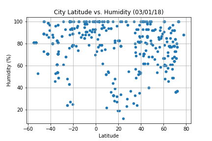

# Analysis

1. The temperature in cities that are closer to the equator(Latitude near zero).
2. There is no strong relationship between latitude and cloudiness
3. There is no strong relationship between latitude and humidity, however, it is interesting to see that a strong band of cities sit between at 80 and 100% humidity.


```python
import requests
import json
import citipy
import random
import pandas as pd
import time
import seaborn as sns
import matplotlib.pyplot as plt
from citipy import citipy
from localenv import api_key

%matplotlib inline

# api.openweathermap.org/data/2.5/find?q=London
```


```python
#function to get the list of cities that will be used to extract weather data
def generate_city_list(number_of_cities):
    cities = []
    lat = 0
    long = 0

    for i in range(number_of_cities):
        lat = round(random.uniform(-90, 90),2)
        long = round(random.uniform(-180, 180),2)
        city = citipy.nearest_city(lat, long)
        if city is not None and city not in cities:
            cities.append(city)
            
    return cities
```


```python
#function to get the weather data from the list of cities
def get_weather_data(cities, weather_data, sample_size, counter):
    base_url = "http://api.openweathermap.org/data/2.5/weather?"
    params = {"appid": api_key,
          "q": "",
          "units":"imperial"}
    
    for city in cities:
        counter += 1
        params["q"] = city.city_name
        target_url= f"{base_url}appid={api_key}&units=imperial&q={city.city_name}"
        print(f"Processing Record {counter} of {sample_size} | {city.city_name}")
        print(target_url)
        response = requests.get(target_url).json()
        #response = requests.get(base_url,params=params).json()
        try:
            if (response is not None and response['cod'] == 200):
                weather_data.append(response)
        except Exception as e:
            print(e)
            pass
        
        if(counter % 10 == 0):
            time.sleep(6)
    
    return weather_data
```


```python
#get the weather data
sample_size = 500
city_list = []
weather_json_l = []

while (len(weather_json_l) < sample_size):
    city_list = generate_city_list(sample_size-len(weather_json_l))  # get the city list
    weather_json_l = get_weather_data(city_list, weather_json_l, sample_size, len(weather_json_l))
    print(f"{len(weather_json_l)}  , {sample_size}")
    
print(len(weather_json_l))
#weather_json_l[0]
```

    Processing Record 1 of 500 | carnarvon
    http://api.openweathermap.org/data/2.5/weather?appid=e23b8b0de428efa9ed43081cb6f04a77&units=imperial&q=carnarvon
    Processing Record 2 of 500 | port alfred
    http://api.openweathermap.org/data/2.5/weather?appid=e23b8b0de428efa9ed43081cb6f04a77&units=imperial&q=port alfred
    Processing Record 3 of 500 | albany
    http://api.openweathermap.org/data/2.5/weather?appid=e23b8b0de428efa9ed43081cb6f04a77&units=imperial&q=albany
    Processing Record 4 of 500 | chkalovskoye
    http://api.openweathermap.org/data/2.5/weather?appid=e23b8b0de428efa9ed43081cb6f04a77&units=imperial&q=chkalovskoye
    Processing Record 5 of 500 | inhambane
    http://api.openweathermap.org/data/2.5/weather?appid=e23b8b0de428efa9ed43081cb6f04a77&units=imperial&q=inhambane
    Processing Record 6 of 500 | severo-kurilsk
    http://api.openweathermap.org/data/2.5/weather?appid=e23b8b0de428efa9ed43081cb6f04a77&units=imperial&q=severo-kurilsk
    Processing Record 7 of 500 | avarua
    http://api.openweathermap.org/data/2.5/weather?appid=e23b8b0de428efa9ed43081cb6f04a77&units=imperial&q=avarua
    Processing Record 8 of 500 | amderma
    http://api.openweathermap.org/data/2.5/weather?appid=e23b8b0de428efa9ed43081cb6f04a77&units=imperial&q=amderma
    Processing Record 9 of 500 | upernavik
    http://api.openweathermap.org/data/2.5/weather?appid=e23b8b0de428efa9ed43081cb6f04a77&units=imperial&q=upernavik
    Processing Record 10 of 500 | kapaa
    http://api.openweathermap.org/data/2.5/weather?appid=e23b8b0de428efa9ed43081cb6f04a77&units=imperial&q=kapaa
    Processing Record 11 of 500 | taolanaro
    http://api.openweathermap.org/data/2.5/weather?appid=e23b8b0de428efa9ed43081cb6f04a77&units=imperial&q=taolanaro
    Processing Record 12 of 500 | lompoc
    http://api.openweathermap.org/data/2.5/weather?appid=e23b8b0de428efa9ed43081cb6f04a77&units=imperial&q=lompoc
    Processing Record 13 of 500 | poltavka
    http://api.openweathermap.org/data/2.5/weather?appid=e23b8b0de428efa9ed43081cb6f04a77&units=imperial&q=poltavka
    Processing Record 14 of 500 | hithadhoo
    http://api.openweathermap.org/data/2.5/weather?appid=e23b8b0de428efa9ed43081cb6f04a77&units=imperial&q=hithadhoo
    Processing Record 15 of 500 | dikson
    http://api.openweathermap.org/data/2.5/weather?appid=e23b8b0de428efa9ed43081cb6f04a77&units=imperial&q=dikson
    Processing Record 16 of 500 | staryy nadym
    http://api.openweathermap.org/data/2.5/weather?appid=e23b8b0de428efa9ed43081cb6f04a77&units=imperial&q=staryy nadym
    Processing Record 17 of 500 | ostrovnoy
    http://api.openweathermap.org/data/2.5/weather?appid=e23b8b0de428efa9ed43081cb6f04a77&units=imperial&q=ostrovnoy
    Processing Record 18 of 500 | butaritari
    http://api.openweathermap.org/data/2.5/weather?appid=e23b8b0de428efa9ed43081cb6f04a77&units=imperial&q=butaritari
    Processing Record 19 of 500 | bredasdorp
    http://api.openweathermap.org/data/2.5/weather?appid=e23b8b0de428efa9ed43081cb6f04a77&units=imperial&q=bredasdorp
    Processing Record 20 of 500 | los llanos de aridane
    http://api.openweathermap.org/data/2.5/weather?appid=e23b8b0de428efa9ed43081cb6f04a77&units=imperial&q=los llanos de aridane
    Processing Record 21 of 500 | khatanga
    http://api.openweathermap.org/data/2.5/weather?appid=e23b8b0de428efa9ed43081cb6f04a77&units=imperial&q=khatanga
    Processing Record 22 of 500 | roebourne
    http://api.openweathermap.org/data/2.5/weather?appid=e23b8b0de428efa9ed43081cb6f04a77&units=imperial&q=roebourne
    Processing Record 23 of 500 | lebedyn
    http://api.openweathermap.org/data/2.5/weather?appid=e23b8b0de428efa9ed43081cb6f04a77&units=imperial&q=lebedyn
    Processing Record 24 of 500 | yar-sale
    http://api.openweathermap.org/data/2.5/weather?appid=e23b8b0de428efa9ed43081cb6f04a77&units=imperial&q=yar-sale
    Processing Record 25 of 500 | raga
    http://api.openweathermap.org/data/2.5/weather?appid=e23b8b0de428efa9ed43081cb6f04a77&units=imperial&q=raga
    Processing Record 26 of 500 | hofn
    http://api.openweathermap.org/data/2.5/weather?appid=e23b8b0de428efa9ed43081cb6f04a77&units=imperial&q=hofn
    Processing Record 27 of 500 | san patricio
    http://api.openweathermap.org/data/2.5/weather?appid=e23b8b0de428efa9ed43081cb6f04a77&units=imperial&q=san patricio
    Processing Record 28 of 500 | jamestown
    http://api.openweathermap.org/data/2.5/weather?appid=e23b8b0de428efa9ed43081cb6f04a77&units=imperial&q=jamestown
    Processing Record 29 of 500 | ixtapa
    http://api.openweathermap.org/data/2.5/weather?appid=e23b8b0de428efa9ed43081cb6f04a77&units=imperial&q=ixtapa
    Processing Record 30 of 500 | rikitea
    http://api.openweathermap.org/data/2.5/weather?appid=e23b8b0de428efa9ed43081cb6f04a77&units=imperial&q=rikitea
    Processing Record 31 of 500 | saskylakh
    http://api.openweathermap.org/data/2.5/weather?appid=e23b8b0de428efa9ed43081cb6f04a77&units=imperial&q=saskylakh
    Processing Record 32 of 500 | atuona
    http://api.openweathermap.org/data/2.5/weather?appid=e23b8b0de428efa9ed43081cb6f04a77&units=imperial&q=atuona
    Processing Record 33 of 500 | tasiilaq
    http://api.openweathermap.org/data/2.5/weather?appid=e23b8b0de428efa9ed43081cb6f04a77&units=imperial&q=tasiilaq
    Processing Record 34 of 500 | ribeira grande
    http://api.openweathermap.org/data/2.5/weather?appid=e23b8b0de428efa9ed43081cb6f04a77&units=imperial&q=ribeira grande
    Processing Record 35 of 500 | vila franca do campo
    http://api.openweathermap.org/data/2.5/weather?appid=e23b8b0de428efa9ed43081cb6f04a77&units=imperial&q=vila franca do campo
    Processing Record 36 of 500 | chapais
    http://api.openweathermap.org/data/2.5/weather?appid=e23b8b0de428efa9ed43081cb6f04a77&units=imperial&q=chapais
    Processing Record 37 of 500 | souillac
    http://api.openweathermap.org/data/2.5/weather?appid=e23b8b0de428efa9ed43081cb6f04a77&units=imperial&q=souillac
    Processing Record 38 of 500 | campina verde
    http://api.openweathermap.org/data/2.5/weather?appid=e23b8b0de428efa9ed43081cb6f04a77&units=imperial&q=campina verde
    Processing Record 39 of 500 | new norfolk
    http://api.openweathermap.org/data/2.5/weather?appid=e23b8b0de428efa9ed43081cb6f04a77&units=imperial&q=new norfolk
    Processing Record 40 of 500 | grand river south east
    http://api.openweathermap.org/data/2.5/weather?appid=e23b8b0de428efa9ed43081cb6f04a77&units=imperial&q=grand river south east
    Processing Record 41 of 500 | vanimo
    http://api.openweathermap.org/data/2.5/weather?appid=e23b8b0de428efa9ed43081cb6f04a77&units=imperial&q=vanimo
    Processing Record 42 of 500 | clyde river
    http://api.openweathermap.org/data/2.5/weather?appid=e23b8b0de428efa9ed43081cb6f04a77&units=imperial&q=clyde river
    Processing Record 43 of 500 | lebu
    http://api.openweathermap.org/data/2.5/weather?appid=e23b8b0de428efa9ed43081cb6f04a77&units=imperial&q=lebu
    Processing Record 44 of 500 | bathsheba
    http://api.openweathermap.org/data/2.5/weather?appid=e23b8b0de428efa9ed43081cb6f04a77&units=imperial&q=bathsheba
    Processing Record 45 of 500 | bluff
    http://api.openweathermap.org/data/2.5/weather?appid=e23b8b0de428efa9ed43081cb6f04a77&units=imperial&q=bluff
    Processing Record 46 of 500 | muswellbrook
    http://api.openweathermap.org/data/2.5/weather?appid=e23b8b0de428efa9ed43081cb6f04a77&units=imperial&q=muswellbrook
    Processing Record 47 of 500 | lazaro cardenas
    http://api.openweathermap.org/data/2.5/weather?appid=e23b8b0de428efa9ed43081cb6f04a77&units=imperial&q=lazaro cardenas
    Processing Record 48 of 500 | verkhneuralsk
    http://api.openweathermap.org/data/2.5/weather?appid=e23b8b0de428efa9ed43081cb6f04a77&units=imperial&q=verkhneuralsk
    Processing Record 49 of 500 | hilo
    http://api.openweathermap.org/data/2.5/weather?appid=e23b8b0de428efa9ed43081cb6f04a77&units=imperial&q=hilo
    Processing Record 50 of 500 | sao filipe
    http://api.openweathermap.org/data/2.5/weather?appid=e23b8b0de428efa9ed43081cb6f04a77&units=imperial&q=sao filipe
    Processing Record 51 of 500 | ushuaia
    http://api.openweathermap.org/data/2.5/weather?appid=e23b8b0de428efa9ed43081cb6f04a77&units=imperial&q=ushuaia
    Processing Record 52 of 500 | port elizabeth
    http://api.openweathermap.org/data/2.5/weather?appid=e23b8b0de428efa9ed43081cb6f04a77&units=imperial&q=port elizabeth
    Processing Record 53 of 500 | saint-augustin
    http://api.openweathermap.org/data/2.5/weather?appid=e23b8b0de428efa9ed43081cb6f04a77&units=imperial&q=saint-augustin
    Processing Record 54 of 500 | kayerkan
    http://api.openweathermap.org/data/2.5/weather?appid=e23b8b0de428efa9ed43081cb6f04a77&units=imperial&q=kayerkan
    Processing Record 55 of 500 | carauari
    http://api.openweathermap.org/data/2.5/weather?appid=e23b8b0de428efa9ed43081cb6f04a77&units=imperial&q=carauari
    Processing Record 56 of 500 | straumen
    http://api.openweathermap.org/data/2.5/weather?appid=e23b8b0de428efa9ed43081cb6f04a77&units=imperial&q=straumen
    Processing Record 57 of 500 | mataura
    http://api.openweathermap.org/data/2.5/weather?appid=e23b8b0de428efa9ed43081cb6f04a77&units=imperial&q=mataura
    Processing Record 58 of 500 | benghazi
    http://api.openweathermap.org/data/2.5/weather?appid=e23b8b0de428efa9ed43081cb6f04a77&units=imperial&q=benghazi
    Processing Record 59 of 500 | phan thiet
    http://api.openweathermap.org/data/2.5/weather?appid=e23b8b0de428efa9ed43081cb6f04a77&units=imperial&q=phan thiet
    Processing Record 60 of 500 | castro
    http://api.openweathermap.org/data/2.5/weather?appid=e23b8b0de428efa9ed43081cb6f04a77&units=imperial&q=castro
    Processing Record 61 of 500 | lorengau
    http://api.openweathermap.org/data/2.5/weather?appid=e23b8b0de428efa9ed43081cb6f04a77&units=imperial&q=lorengau
    Processing Record 62 of 500 | attawapiskat
    http://api.openweathermap.org/data/2.5/weather?appid=e23b8b0de428efa9ed43081cb6f04a77&units=imperial&q=attawapiskat
    Processing Record 63 of 500 | hasaki
    http://api.openweathermap.org/data/2.5/weather?appid=e23b8b0de428efa9ed43081cb6f04a77&units=imperial&q=hasaki
    Processing Record 64 of 500 | newport
    http://api.openweathermap.org/data/2.5/weather?appid=e23b8b0de428efa9ed43081cb6f04a77&units=imperial&q=newport
    Processing Record 65 of 500 | kodiak
    http://api.openweathermap.org/data/2.5/weather?appid=e23b8b0de428efa9ed43081cb6f04a77&units=imperial&q=kodiak
    Processing Record 66 of 500 | puerto narino
    http://api.openweathermap.org/data/2.5/weather?appid=e23b8b0de428efa9ed43081cb6f04a77&units=imperial&q=puerto narino
    Processing Record 67 of 500 | bystryy istok
    http://api.openweathermap.org/data/2.5/weather?appid=e23b8b0de428efa9ed43081cb6f04a77&units=imperial&q=bystryy istok
    Processing Record 68 of 500 | porto nacional
    http://api.openweathermap.org/data/2.5/weather?appid=e23b8b0de428efa9ed43081cb6f04a77&units=imperial&q=porto nacional
    Processing Record 69 of 500 | punta arenas
    http://api.openweathermap.org/data/2.5/weather?appid=e23b8b0de428efa9ed43081cb6f04a77&units=imperial&q=punta arenas
    Processing Record 70 of 500 | talnakh
    http://api.openweathermap.org/data/2.5/weather?appid=e23b8b0de428efa9ed43081cb6f04a77&units=imperial&q=talnakh
    Processing Record 71 of 500 | anloga
    http://api.openweathermap.org/data/2.5/weather?appid=e23b8b0de428efa9ed43081cb6f04a77&units=imperial&q=anloga
    Processing Record 72 of 500 | coquimbo
    http://api.openweathermap.org/data/2.5/weather?appid=e23b8b0de428efa9ed43081cb6f04a77&units=imperial&q=coquimbo
    Processing Record 73 of 500 | verkhoyansk
    http://api.openweathermap.org/data/2.5/weather?appid=e23b8b0de428efa9ed43081cb6f04a77&units=imperial&q=verkhoyansk
    Processing Record 74 of 500 | hermanus
    http://api.openweathermap.org/data/2.5/weather?appid=e23b8b0de428efa9ed43081cb6f04a77&units=imperial&q=hermanus
    Processing Record 75 of 500 | tuktoyaktuk
    http://api.openweathermap.org/data/2.5/weather?appid=e23b8b0de428efa9ed43081cb6f04a77&units=imperial&q=tuktoyaktuk
    Processing Record 76 of 500 | kutum
    http://api.openweathermap.org/data/2.5/weather?appid=e23b8b0de428efa9ed43081cb6f04a77&units=imperial&q=kutum
    Processing Record 77 of 500 | tumannyy
    http://api.openweathermap.org/data/2.5/weather?appid=e23b8b0de428efa9ed43081cb6f04a77&units=imperial&q=tumannyy
    Processing Record 78 of 500 | mrirt
    http://api.openweathermap.org/data/2.5/weather?appid=e23b8b0de428efa9ed43081cb6f04a77&units=imperial&q=mrirt
    Processing Record 79 of 500 | kavaratti
    http://api.openweathermap.org/data/2.5/weather?appid=e23b8b0de428efa9ed43081cb6f04a77&units=imperial&q=kavaratti
    Processing Record 80 of 500 | cidreira
    http://api.openweathermap.org/data/2.5/weather?appid=e23b8b0de428efa9ed43081cb6f04a77&units=imperial&q=cidreira
    Processing Record 81 of 500 | kamenskoye
    http://api.openweathermap.org/data/2.5/weather?appid=e23b8b0de428efa9ed43081cb6f04a77&units=imperial&q=kamenskoye
    Processing Record 82 of 500 | calvinia
    http://api.openweathermap.org/data/2.5/weather?appid=e23b8b0de428efa9ed43081cb6f04a77&units=imperial&q=calvinia
    Processing Record 83 of 500 | vaini
    http://api.openweathermap.org/data/2.5/weather?appid=e23b8b0de428efa9ed43081cb6f04a77&units=imperial&q=vaini
    Processing Record 84 of 500 | thompson
    http://api.openweathermap.org/data/2.5/weather?appid=e23b8b0de428efa9ed43081cb6f04a77&units=imperial&q=thompson
    Processing Record 85 of 500 | narrabri
    http://api.openweathermap.org/data/2.5/weather?appid=e23b8b0de428efa9ed43081cb6f04a77&units=imperial&q=narrabri
    Processing Record 86 of 500 | kloulklubed
    http://api.openweathermap.org/data/2.5/weather?appid=e23b8b0de428efa9ed43081cb6f04a77&units=imperial&q=kloulklubed
    Processing Record 87 of 500 | sentyabrskiy
    http://api.openweathermap.org/data/2.5/weather?appid=e23b8b0de428efa9ed43081cb6f04a77&units=imperial&q=sentyabrskiy
    Processing Record 88 of 500 | thanh hoa
    http://api.openweathermap.org/data/2.5/weather?appid=e23b8b0de428efa9ed43081cb6f04a77&units=imperial&q=thanh hoa
    Processing Record 89 of 500 | chokurdakh
    http://api.openweathermap.org/data/2.5/weather?appid=e23b8b0de428efa9ed43081cb6f04a77&units=imperial&q=chokurdakh
    Processing Record 90 of 500 | vaitupu
    http://api.openweathermap.org/data/2.5/weather?appid=e23b8b0de428efa9ed43081cb6f04a77&units=imperial&q=vaitupu
    Processing Record 91 of 500 | nizhneyansk
    http://api.openweathermap.org/data/2.5/weather?appid=e23b8b0de428efa9ed43081cb6f04a77&units=imperial&q=nizhneyansk
    Processing Record 92 of 500 | taltal
    http://api.openweathermap.org/data/2.5/weather?appid=e23b8b0de428efa9ed43081cb6f04a77&units=imperial&q=taltal
    Processing Record 93 of 500 | nara
    http://api.openweathermap.org/data/2.5/weather?appid=e23b8b0de428efa9ed43081cb6f04a77&units=imperial&q=nara
    Processing Record 94 of 500 | santa rosa
    http://api.openweathermap.org/data/2.5/weather?appid=e23b8b0de428efa9ed43081cb6f04a77&units=imperial&q=santa rosa
    Processing Record 95 of 500 | kumla
    http://api.openweathermap.org/data/2.5/weather?appid=e23b8b0de428efa9ed43081cb6f04a77&units=imperial&q=kumla
    Processing Record 96 of 500 | guerrero negro
    http://api.openweathermap.org/data/2.5/weather?appid=e23b8b0de428efa9ed43081cb6f04a77&units=imperial&q=guerrero negro
    Processing Record 97 of 500 | klaksvik
    http://api.openweathermap.org/data/2.5/weather?appid=e23b8b0de428efa9ed43081cb6f04a77&units=imperial&q=klaksvik
    Processing Record 98 of 500 | mahebourg
    http://api.openweathermap.org/data/2.5/weather?appid=e23b8b0de428efa9ed43081cb6f04a77&units=imperial&q=mahebourg
    Processing Record 99 of 500 | conde
    http://api.openweathermap.org/data/2.5/weather?appid=e23b8b0de428efa9ed43081cb6f04a77&units=imperial&q=conde
    Processing Record 100 of 500 | kununurra
    http://api.openweathermap.org/data/2.5/weather?appid=e23b8b0de428efa9ed43081cb6f04a77&units=imperial&q=kununurra
    Processing Record 101 of 500 | ponta do sol
    http://api.openweathermap.org/data/2.5/weather?appid=e23b8b0de428efa9ed43081cb6f04a77&units=imperial&q=ponta do sol
    Processing Record 102 of 500 | san quintin
    http://api.openweathermap.org/data/2.5/weather?appid=e23b8b0de428efa9ed43081cb6f04a77&units=imperial&q=san quintin
    Processing Record 103 of 500 | victoria
    http://api.openweathermap.org/data/2.5/weather?appid=e23b8b0de428efa9ed43081cb6f04a77&units=imperial&q=victoria
    Processing Record 104 of 500 | coronado
    http://api.openweathermap.org/data/2.5/weather?appid=e23b8b0de428efa9ed43081cb6f04a77&units=imperial&q=coronado
    Processing Record 105 of 500 | ahipara
    http://api.openweathermap.org/data/2.5/weather?appid=e23b8b0de428efa9ed43081cb6f04a77&units=imperial&q=ahipara
    Processing Record 106 of 500 | bethel
    http://api.openweathermap.org/data/2.5/weather?appid=e23b8b0de428efa9ed43081cb6f04a77&units=imperial&q=bethel
    Processing Record 107 of 500 | berlevag
    http://api.openweathermap.org/data/2.5/weather?appid=e23b8b0de428efa9ed43081cb6f04a77&units=imperial&q=berlevag
    Processing Record 108 of 500 | tiksi
    http://api.openweathermap.org/data/2.5/weather?appid=e23b8b0de428efa9ed43081cb6f04a77&units=imperial&q=tiksi
    Processing Record 109 of 500 | muros
    http://api.openweathermap.org/data/2.5/weather?appid=e23b8b0de428efa9ed43081cb6f04a77&units=imperial&q=muros
    Processing Record 110 of 500 | salalah
    http://api.openweathermap.org/data/2.5/weather?appid=e23b8b0de428efa9ed43081cb6f04a77&units=imperial&q=salalah
    Processing Record 111 of 500 | gangotri
    http://api.openweathermap.org/data/2.5/weather?appid=e23b8b0de428efa9ed43081cb6f04a77&units=imperial&q=gangotri
    Processing Record 112 of 500 | mpongwe
    http://api.openweathermap.org/data/2.5/weather?appid=e23b8b0de428efa9ed43081cb6f04a77&units=imperial&q=mpongwe
    Processing Record 113 of 500 | hobart
    http://api.openweathermap.org/data/2.5/weather?appid=e23b8b0de428efa9ed43081cb6f04a77&units=imperial&q=hobart
    Processing Record 114 of 500 | touros
    http://api.openweathermap.org/data/2.5/weather?appid=e23b8b0de428efa9ed43081cb6f04a77&units=imperial&q=touros
    Processing Record 115 of 500 | bandar-e lengeh
    http://api.openweathermap.org/data/2.5/weather?appid=e23b8b0de428efa9ed43081cb6f04a77&units=imperial&q=bandar-e lengeh
    Processing Record 116 of 500 | georgetown
    http://api.openweathermap.org/data/2.5/weather?appid=e23b8b0de428efa9ed43081cb6f04a77&units=imperial&q=georgetown
    Processing Record 117 of 500 | nikolskoye
    http://api.openweathermap.org/data/2.5/weather?appid=e23b8b0de428efa9ed43081cb6f04a77&units=imperial&q=nikolskoye
    Processing Record 118 of 500 | leningradskiy
    http://api.openweathermap.org/data/2.5/weather?appid=e23b8b0de428efa9ed43081cb6f04a77&units=imperial&q=leningradskiy
    Processing Record 119 of 500 | pierre
    http://api.openweathermap.org/data/2.5/weather?appid=e23b8b0de428efa9ed43081cb6f04a77&units=imperial&q=pierre
    Processing Record 120 of 500 | neryungri
    http://api.openweathermap.org/data/2.5/weather?appid=e23b8b0de428efa9ed43081cb6f04a77&units=imperial&q=neryungri
    Processing Record 121 of 500 | ornskoldsvik
    http://api.openweathermap.org/data/2.5/weather?appid=e23b8b0de428efa9ed43081cb6f04a77&units=imperial&q=ornskoldsvik
    Processing Record 122 of 500 | conchal
    http://api.openweathermap.org/data/2.5/weather?appid=e23b8b0de428efa9ed43081cb6f04a77&units=imperial&q=conchal
    Processing Record 123 of 500 | busselton
    http://api.openweathermap.org/data/2.5/weather?appid=e23b8b0de428efa9ed43081cb6f04a77&units=imperial&q=busselton
    Processing Record 124 of 500 | bengkalis
    http://api.openweathermap.org/data/2.5/weather?appid=e23b8b0de428efa9ed43081cb6f04a77&units=imperial&q=bengkalis
    Processing Record 125 of 500 | constitucion
    http://api.openweathermap.org/data/2.5/weather?appid=e23b8b0de428efa9ed43081cb6f04a77&units=imperial&q=constitucion
    Processing Record 126 of 500 | salaga
    http://api.openweathermap.org/data/2.5/weather?appid=e23b8b0de428efa9ed43081cb6f04a77&units=imperial&q=salaga
    Processing Record 127 of 500 | okakarara
    http://api.openweathermap.org/data/2.5/weather?appid=e23b8b0de428efa9ed43081cb6f04a77&units=imperial&q=okakarara
    Processing Record 128 of 500 | tete
    http://api.openweathermap.org/data/2.5/weather?appid=e23b8b0de428efa9ed43081cb6f04a77&units=imperial&q=tete
    Processing Record 129 of 500 | bad gandersheim
    http://api.openweathermap.org/data/2.5/weather?appid=e23b8b0de428efa9ed43081cb6f04a77&units=imperial&q=bad gandersheim
    Processing Record 130 of 500 | aklavik
    http://api.openweathermap.org/data/2.5/weather?appid=e23b8b0de428efa9ed43081cb6f04a77&units=imperial&q=aklavik
    Processing Record 131 of 500 | moberly
    http://api.openweathermap.org/data/2.5/weather?appid=e23b8b0de428efa9ed43081cb6f04a77&units=imperial&q=moberly
    Processing Record 132 of 500 | barrow
    http://api.openweathermap.org/data/2.5/weather?appid=e23b8b0de428efa9ed43081cb6f04a77&units=imperial&q=barrow
    Processing Record 133 of 500 | yerbogachen
    http://api.openweathermap.org/data/2.5/weather?appid=e23b8b0de428efa9ed43081cb6f04a77&units=imperial&q=yerbogachen
    Processing Record 134 of 500 | kaitangata
    http://api.openweathermap.org/data/2.5/weather?appid=e23b8b0de428efa9ed43081cb6f04a77&units=imperial&q=kaitangata
    Processing Record 135 of 500 | dongsheng
    http://api.openweathermap.org/data/2.5/weather?appid=e23b8b0de428efa9ed43081cb6f04a77&units=imperial&q=dongsheng
    Processing Record 136 of 500 | peniche
    http://api.openweathermap.org/data/2.5/weather?appid=e23b8b0de428efa9ed43081cb6f04a77&units=imperial&q=peniche
    Processing Record 137 of 500 | mahibadhoo
    http://api.openweathermap.org/data/2.5/weather?appid=e23b8b0de428efa9ed43081cb6f04a77&units=imperial&q=mahibadhoo
    Processing Record 138 of 500 | poum
    http://api.openweathermap.org/data/2.5/weather?appid=e23b8b0de428efa9ed43081cb6f04a77&units=imperial&q=poum
    Processing Record 139 of 500 | jambi
    http://api.openweathermap.org/data/2.5/weather?appid=e23b8b0de428efa9ed43081cb6f04a77&units=imperial&q=jambi
    Processing Record 140 of 500 | barentsburg
    http://api.openweathermap.org/data/2.5/weather?appid=e23b8b0de428efa9ed43081cb6f04a77&units=imperial&q=barentsburg
    Processing Record 141 of 500 | cabo san lucas
    http://api.openweathermap.org/data/2.5/weather?appid=e23b8b0de428efa9ed43081cb6f04a77&units=imperial&q=cabo san lucas
    Processing Record 142 of 500 | san policarpo
    http://api.openweathermap.org/data/2.5/weather?appid=e23b8b0de428efa9ed43081cb6f04a77&units=imperial&q=san policarpo
    Processing Record 143 of 500 | panguna
    http://api.openweathermap.org/data/2.5/weather?appid=e23b8b0de428efa9ed43081cb6f04a77&units=imperial&q=panguna
    Processing Record 144 of 500 | bengkulu
    http://api.openweathermap.org/data/2.5/weather?appid=e23b8b0de428efa9ed43081cb6f04a77&units=imperial&q=bengkulu
    Processing Record 145 of 500 | bolivar
    http://api.openweathermap.org/data/2.5/weather?appid=e23b8b0de428efa9ed43081cb6f04a77&units=imperial&q=bolivar
    Processing Record 146 of 500 | great falls
    http://api.openweathermap.org/data/2.5/weather?appid=e23b8b0de428efa9ed43081cb6f04a77&units=imperial&q=great falls
    Processing Record 147 of 500 | cravo norte
    http://api.openweathermap.org/data/2.5/weather?appid=e23b8b0de428efa9ed43081cb6f04a77&units=imperial&q=cravo norte
    Processing Record 148 of 500 | roma
    http://api.openweathermap.org/data/2.5/weather?appid=e23b8b0de428efa9ed43081cb6f04a77&units=imperial&q=roma
    Processing Record 149 of 500 | prince rupert
    http://api.openweathermap.org/data/2.5/weather?appid=e23b8b0de428efa9ed43081cb6f04a77&units=imperial&q=prince rupert
    Processing Record 150 of 500 | alofi
    http://api.openweathermap.org/data/2.5/weather?appid=e23b8b0de428efa9ed43081cb6f04a77&units=imperial&q=alofi
    Processing Record 151 of 500 | paita
    http://api.openweathermap.org/data/2.5/weather?appid=e23b8b0de428efa9ed43081cb6f04a77&units=imperial&q=paita
    Processing Record 152 of 500 | ponta delgada
    http://api.openweathermap.org/data/2.5/weather?appid=e23b8b0de428efa9ed43081cb6f04a77&units=imperial&q=ponta delgada
    Processing Record 153 of 500 | gisborne
    http://api.openweathermap.org/data/2.5/weather?appid=e23b8b0de428efa9ed43081cb6f04a77&units=imperial&q=gisborne
    Processing Record 154 of 500 | hammerfest
    http://api.openweathermap.org/data/2.5/weather?appid=e23b8b0de428efa9ed43081cb6f04a77&units=imperial&q=hammerfest
    Processing Record 155 of 500 | umzimvubu
    http://api.openweathermap.org/data/2.5/weather?appid=e23b8b0de428efa9ed43081cb6f04a77&units=imperial&q=umzimvubu
    Processing Record 156 of 500 | katangli
    http://api.openweathermap.org/data/2.5/weather?appid=e23b8b0de428efa9ed43081cb6f04a77&units=imperial&q=katangli
    Processing Record 157 of 500 | torbay
    http://api.openweathermap.org/data/2.5/weather?appid=e23b8b0de428efa9ed43081cb6f04a77&units=imperial&q=torbay
    Processing Record 158 of 500 | faanui
    http://api.openweathermap.org/data/2.5/weather?appid=e23b8b0de428efa9ed43081cb6f04a77&units=imperial&q=faanui
    Processing Record 159 of 500 | east london
    http://api.openweathermap.org/data/2.5/weather?appid=e23b8b0de428efa9ed43081cb6f04a77&units=imperial&q=east london
    Processing Record 160 of 500 | qaanaaq
    http://api.openweathermap.org/data/2.5/weather?appid=e23b8b0de428efa9ed43081cb6f04a77&units=imperial&q=qaanaaq
    Processing Record 161 of 500 | havelock
    http://api.openweathermap.org/data/2.5/weather?appid=e23b8b0de428efa9ed43081cb6f04a77&units=imperial&q=havelock
    Processing Record 162 of 500 | westpunt
    http://api.openweathermap.org/data/2.5/weather?appid=e23b8b0de428efa9ed43081cb6f04a77&units=imperial&q=westpunt
    Processing Record 163 of 500 | illoqqortoormiut
    http://api.openweathermap.org/data/2.5/weather?appid=e23b8b0de428efa9ed43081cb6f04a77&units=imperial&q=illoqqortoormiut
    Processing Record 164 of 500 | asau
    http://api.openweathermap.org/data/2.5/weather?appid=e23b8b0de428efa9ed43081cb6f04a77&units=imperial&q=asau
    Processing Record 165 of 500 | kaeo
    http://api.openweathermap.org/data/2.5/weather?appid=e23b8b0de428efa9ed43081cb6f04a77&units=imperial&q=kaeo
    Processing Record 166 of 500 | karauzyak
    http://api.openweathermap.org/data/2.5/weather?appid=e23b8b0de428efa9ed43081cb6f04a77&units=imperial&q=karauzyak
    Processing Record 167 of 500 | belushya guba
    http://api.openweathermap.org/data/2.5/weather?appid=e23b8b0de428efa9ed43081cb6f04a77&units=imperial&q=belushya guba
    Processing Record 168 of 500 | saint george
    http://api.openweathermap.org/data/2.5/weather?appid=e23b8b0de428efa9ed43081cb6f04a77&units=imperial&q=saint george
    Processing Record 169 of 500 | komsomolskiy
    http://api.openweathermap.org/data/2.5/weather?appid=e23b8b0de428efa9ed43081cb6f04a77&units=imperial&q=komsomolskiy
    Processing Record 170 of 500 | tucurui
    http://api.openweathermap.org/data/2.5/weather?appid=e23b8b0de428efa9ed43081cb6f04a77&units=imperial&q=tucurui
    Processing Record 171 of 500 | fort-shevchenko
    http://api.openweathermap.org/data/2.5/weather?appid=e23b8b0de428efa9ed43081cb6f04a77&units=imperial&q=fort-shevchenko
    Processing Record 172 of 500 | kiama
    http://api.openweathermap.org/data/2.5/weather?appid=e23b8b0de428efa9ed43081cb6f04a77&units=imperial&q=kiama
    Processing Record 173 of 500 | santiago del estero
    http://api.openweathermap.org/data/2.5/weather?appid=e23b8b0de428efa9ed43081cb6f04a77&units=imperial&q=santiago del estero
    Processing Record 174 of 500 | jalu
    http://api.openweathermap.org/data/2.5/weather?appid=e23b8b0de428efa9ed43081cb6f04a77&units=imperial&q=jalu
    Processing Record 175 of 500 | cayenne
    http://api.openweathermap.org/data/2.5/weather?appid=e23b8b0de428efa9ed43081cb6f04a77&units=imperial&q=cayenne
    Processing Record 176 of 500 | zhigansk
    http://api.openweathermap.org/data/2.5/weather?appid=e23b8b0de428efa9ed43081cb6f04a77&units=imperial&q=zhigansk
    Processing Record 177 of 500 | matanzas
    http://api.openweathermap.org/data/2.5/weather?appid=e23b8b0de428efa9ed43081cb6f04a77&units=imperial&q=matanzas
    Processing Record 178 of 500 | sabang
    http://api.openweathermap.org/data/2.5/weather?appid=e23b8b0de428efa9ed43081cb6f04a77&units=imperial&q=sabang
    Processing Record 179 of 500 | makakilo city
    http://api.openweathermap.org/data/2.5/weather?appid=e23b8b0de428efa9ed43081cb6f04a77&units=imperial&q=makakilo city
    Processing Record 180 of 500 | gobabis
    http://api.openweathermap.org/data/2.5/weather?appid=e23b8b0de428efa9ed43081cb6f04a77&units=imperial&q=gobabis
    Processing Record 181 of 500 | kenai
    http://api.openweathermap.org/data/2.5/weather?appid=e23b8b0de428efa9ed43081cb6f04a77&units=imperial&q=kenai
    Processing Record 182 of 500 | arraial do cabo
    http://api.openweathermap.org/data/2.5/weather?appid=e23b8b0de428efa9ed43081cb6f04a77&units=imperial&q=arraial do cabo
    Processing Record 183 of 500 | thinadhoo
    http://api.openweathermap.org/data/2.5/weather?appid=e23b8b0de428efa9ed43081cb6f04a77&units=imperial&q=thinadhoo
    Processing Record 184 of 500 | beloha
    http://api.openweathermap.org/data/2.5/weather?appid=e23b8b0de428efa9ed43081cb6f04a77&units=imperial&q=beloha
    Processing Record 185 of 500 | yellowknife
    http://api.openweathermap.org/data/2.5/weather?appid=e23b8b0de428efa9ed43081cb6f04a77&units=imperial&q=yellowknife
    Processing Record 186 of 500 | adrar
    http://api.openweathermap.org/data/2.5/weather?appid=e23b8b0de428efa9ed43081cb6f04a77&units=imperial&q=adrar
    Processing Record 187 of 500 | saldanha
    http://api.openweathermap.org/data/2.5/weather?appid=e23b8b0de428efa9ed43081cb6f04a77&units=imperial&q=saldanha
    Processing Record 188 of 500 | saleaula
    http://api.openweathermap.org/data/2.5/weather?appid=e23b8b0de428efa9ed43081cb6f04a77&units=imperial&q=saleaula
    Processing Record 189 of 500 | marsh harbour
    http://api.openweathermap.org/data/2.5/weather?appid=e23b8b0de428efa9ed43081cb6f04a77&units=imperial&q=marsh harbour
    Processing Record 190 of 500 | zapolyarnyy
    http://api.openweathermap.org/data/2.5/weather?appid=e23b8b0de428efa9ed43081cb6f04a77&units=imperial&q=zapolyarnyy
    Processing Record 191 of 500 | emerald
    http://api.openweathermap.org/data/2.5/weather?appid=e23b8b0de428efa9ed43081cb6f04a77&units=imperial&q=emerald
    Processing Record 192 of 500 | teguise
    http://api.openweathermap.org/data/2.5/weather?appid=e23b8b0de428efa9ed43081cb6f04a77&units=imperial&q=teguise
    Processing Record 193 of 500 | kannur
    http://api.openweathermap.org/data/2.5/weather?appid=e23b8b0de428efa9ed43081cb6f04a77&units=imperial&q=kannur
    Processing Record 194 of 500 | burica
    http://api.openweathermap.org/data/2.5/weather?appid=e23b8b0de428efa9ed43081cb6f04a77&units=imperial&q=burica
    Processing Record 195 of 500 | luderitz
    http://api.openweathermap.org/data/2.5/weather?appid=e23b8b0de428efa9ed43081cb6f04a77&units=imperial&q=luderitz
    Processing Record 196 of 500 | thaton
    http://api.openweathermap.org/data/2.5/weather?appid=e23b8b0de428efa9ed43081cb6f04a77&units=imperial&q=thaton
    Processing Record 197 of 500 | puerto escondido
    http://api.openweathermap.org/data/2.5/weather?appid=e23b8b0de428efa9ed43081cb6f04a77&units=imperial&q=puerto escondido
    Processing Record 198 of 500 | jiddah
    http://api.openweathermap.org/data/2.5/weather?appid=e23b8b0de428efa9ed43081cb6f04a77&units=imperial&q=jiddah
    Processing Record 199 of 500 | daru
    http://api.openweathermap.org/data/2.5/weather?appid=e23b8b0de428efa9ed43081cb6f04a77&units=imperial&q=daru
    Processing Record 200 of 500 | samusu
    http://api.openweathermap.org/data/2.5/weather?appid=e23b8b0de428efa9ed43081cb6f04a77&units=imperial&q=samusu
    Processing Record 201 of 500 | quimperle
    http://api.openweathermap.org/data/2.5/weather?appid=e23b8b0de428efa9ed43081cb6f04a77&units=imperial&q=quimperle
    Processing Record 202 of 500 | cape town
    http://api.openweathermap.org/data/2.5/weather?appid=e23b8b0de428efa9ed43081cb6f04a77&units=imperial&q=cape town
    Processing Record 203 of 500 | codrington
    http://api.openweathermap.org/data/2.5/weather?appid=e23b8b0de428efa9ed43081cb6f04a77&units=imperial&q=codrington
    Processing Record 204 of 500 | pochutla
    http://api.openweathermap.org/data/2.5/weather?appid=e23b8b0de428efa9ed43081cb6f04a77&units=imperial&q=pochutla
    Processing Record 205 of 500 | maridi
    http://api.openweathermap.org/data/2.5/weather?appid=e23b8b0de428efa9ed43081cb6f04a77&units=imperial&q=maridi
    Processing Record 206 of 500 | hohhot
    http://api.openweathermap.org/data/2.5/weather?appid=e23b8b0de428efa9ed43081cb6f04a77&units=imperial&q=hohhot
    Processing Record 207 of 500 | puerto ayora
    http://api.openweathermap.org/data/2.5/weather?appid=e23b8b0de428efa9ed43081cb6f04a77&units=imperial&q=puerto ayora
    Processing Record 208 of 500 | juifang
    http://api.openweathermap.org/data/2.5/weather?appid=e23b8b0de428efa9ed43081cb6f04a77&units=imperial&q=juifang
    Processing Record 209 of 500 | tual
    http://api.openweathermap.org/data/2.5/weather?appid=e23b8b0de428efa9ed43081cb6f04a77&units=imperial&q=tual
    Processing Record 210 of 500 | grand centre
    http://api.openweathermap.org/data/2.5/weather?appid=e23b8b0de428efa9ed43081cb6f04a77&units=imperial&q=grand centre
    Processing Record 211 of 500 | san carlos de bariloche
    http://api.openweathermap.org/data/2.5/weather?appid=e23b8b0de428efa9ed43081cb6f04a77&units=imperial&q=san carlos de bariloche
    Processing Record 212 of 500 | chuy
    http://api.openweathermap.org/data/2.5/weather?appid=e23b8b0de428efa9ed43081cb6f04a77&units=imperial&q=chuy
    Processing Record 213 of 500 | laguna
    http://api.openweathermap.org/data/2.5/weather?appid=e23b8b0de428efa9ed43081cb6f04a77&units=imperial&q=laguna
    Processing Record 214 of 500 | paamiut
    http://api.openweathermap.org/data/2.5/weather?appid=e23b8b0de428efa9ed43081cb6f04a77&units=imperial&q=paamiut
    Processing Record 215 of 500 | boulder
    http://api.openweathermap.org/data/2.5/weather?appid=e23b8b0de428efa9ed43081cb6f04a77&units=imperial&q=boulder
    Processing Record 216 of 500 | cape coast
    http://api.openweathermap.org/data/2.5/weather?appid=e23b8b0de428efa9ed43081cb6f04a77&units=imperial&q=cape coast
    Processing Record 217 of 500 | la rochelle
    http://api.openweathermap.org/data/2.5/weather?appid=e23b8b0de428efa9ed43081cb6f04a77&units=imperial&q=la rochelle
    Processing Record 218 of 500 | tilichiki
    http://api.openweathermap.org/data/2.5/weather?appid=e23b8b0de428efa9ed43081cb6f04a77&units=imperial&q=tilichiki
    Processing Record 219 of 500 | tucumcari
    http://api.openweathermap.org/data/2.5/weather?appid=e23b8b0de428efa9ed43081cb6f04a77&units=imperial&q=tucumcari
    Processing Record 220 of 500 | mercedes
    http://api.openweathermap.org/data/2.5/weather?appid=e23b8b0de428efa9ed43081cb6f04a77&units=imperial&q=mercedes
    Processing Record 221 of 500 | progreso
    http://api.openweathermap.org/data/2.5/weather?appid=e23b8b0de428efa9ed43081cb6f04a77&units=imperial&q=progreso
    Processing Record 222 of 500 | lamu
    http://api.openweathermap.org/data/2.5/weather?appid=e23b8b0de428efa9ed43081cb6f04a77&units=imperial&q=lamu
    Processing Record 223 of 500 | lagoa
    http://api.openweathermap.org/data/2.5/weather?appid=e23b8b0de428efa9ed43081cb6f04a77&units=imperial&q=lagoa
    Processing Record 224 of 500 | lunel
    http://api.openweathermap.org/data/2.5/weather?appid=e23b8b0de428efa9ed43081cb6f04a77&units=imperial&q=lunel
    Processing Record 225 of 500 | portland
    http://api.openweathermap.org/data/2.5/weather?appid=e23b8b0de428efa9ed43081cb6f04a77&units=imperial&q=portland
    Processing Record 226 of 500 | opuwo
    http://api.openweathermap.org/data/2.5/weather?appid=e23b8b0de428efa9ed43081cb6f04a77&units=imperial&q=opuwo
    Processing Record 227 of 500 | faya
    http://api.openweathermap.org/data/2.5/weather?appid=e23b8b0de428efa9ed43081cb6f04a77&units=imperial&q=faya
    Processing Record 228 of 500 | alice springs
    http://api.openweathermap.org/data/2.5/weather?appid=e23b8b0de428efa9ed43081cb6f04a77&units=imperial&q=alice springs
    Processing Record 229 of 500 | inirida
    http://api.openweathermap.org/data/2.5/weather?appid=e23b8b0de428efa9ed43081cb6f04a77&units=imperial&q=inirida
    Processing Record 230 of 500 | gulf gate estates
    http://api.openweathermap.org/data/2.5/weather?appid=e23b8b0de428efa9ed43081cb6f04a77&units=imperial&q=gulf gate estates
    Processing Record 231 of 500 | high level
    http://api.openweathermap.org/data/2.5/weather?appid=e23b8b0de428efa9ed43081cb6f04a77&units=imperial&q=high level
    Processing Record 232 of 500 | okha
    http://api.openweathermap.org/data/2.5/weather?appid=e23b8b0de428efa9ed43081cb6f04a77&units=imperial&q=okha
    Processing Record 233 of 500 | muli
    http://api.openweathermap.org/data/2.5/weather?appid=e23b8b0de428efa9ed43081cb6f04a77&units=imperial&q=muli
    Processing Record 234 of 500 | muisne
    http://api.openweathermap.org/data/2.5/weather?appid=e23b8b0de428efa9ed43081cb6f04a77&units=imperial&q=muisne
    Processing Record 235 of 500 | mackay
    http://api.openweathermap.org/data/2.5/weather?appid=e23b8b0de428efa9ed43081cb6f04a77&units=imperial&q=mackay
    Processing Record 236 of 500 | nanortalik
    http://api.openweathermap.org/data/2.5/weather?appid=e23b8b0de428efa9ed43081cb6f04a77&units=imperial&q=nanortalik
    Processing Record 237 of 500 | avera
    http://api.openweathermap.org/data/2.5/weather?appid=e23b8b0de428efa9ed43081cb6f04a77&units=imperial&q=avera
    Processing Record 238 of 500 | bambous virieux
    http://api.openweathermap.org/data/2.5/weather?appid=e23b8b0de428efa9ed43081cb6f04a77&units=imperial&q=bambous virieux
    Processing Record 239 of 500 | teahupoo
    http://api.openweathermap.org/data/2.5/weather?appid=e23b8b0de428efa9ed43081cb6f04a77&units=imperial&q=teahupoo
    Processing Record 240 of 500 | boa vista
    http://api.openweathermap.org/data/2.5/weather?appid=e23b8b0de428efa9ed43081cb6f04a77&units=imperial&q=boa vista
    Processing Record 241 of 500 | tapejara
    http://api.openweathermap.org/data/2.5/weather?appid=e23b8b0de428efa9ed43081cb6f04a77&units=imperial&q=tapejara
    Processing Record 242 of 500 | swellendam
    http://api.openweathermap.org/data/2.5/weather?appid=e23b8b0de428efa9ed43081cb6f04a77&units=imperial&q=swellendam
    Processing Record 243 of 500 | margate
    http://api.openweathermap.org/data/2.5/weather?appid=e23b8b0de428efa9ed43081cb6f04a77&units=imperial&q=margate
    Processing Record 244 of 500 | pangnirtung
    http://api.openweathermap.org/data/2.5/weather?appid=e23b8b0de428efa9ed43081cb6f04a77&units=imperial&q=pangnirtung
    Processing Record 245 of 500 | aksu
    http://api.openweathermap.org/data/2.5/weather?appid=e23b8b0de428efa9ed43081cb6f04a77&units=imperial&q=aksu
    Processing Record 246 of 500 | provideniya
    http://api.openweathermap.org/data/2.5/weather?appid=e23b8b0de428efa9ed43081cb6f04a77&units=imperial&q=provideniya
    Processing Record 247 of 500 | igarka
    http://api.openweathermap.org/data/2.5/weather?appid=e23b8b0de428efa9ed43081cb6f04a77&units=imperial&q=igarka
    Processing Record 248 of 500 | mutsamudu
    http://api.openweathermap.org/data/2.5/weather?appid=e23b8b0de428efa9ed43081cb6f04a77&units=imperial&q=mutsamudu
    Processing Record 249 of 500 | lipin bor
    http://api.openweathermap.org/data/2.5/weather?appid=e23b8b0de428efa9ed43081cb6f04a77&units=imperial&q=lipin bor
    Processing Record 250 of 500 | nyimba
    http://api.openweathermap.org/data/2.5/weather?appid=e23b8b0de428efa9ed43081cb6f04a77&units=imperial&q=nyimba
    Processing Record 251 of 500 | nalut
    http://api.openweathermap.org/data/2.5/weather?appid=e23b8b0de428efa9ed43081cb6f04a77&units=imperial&q=nalut
    Processing Record 252 of 500 | kimparana
    http://api.openweathermap.org/data/2.5/weather?appid=e23b8b0de428efa9ed43081cb6f04a77&units=imperial&q=kimparana
    Processing Record 253 of 500 | olafsvik
    http://api.openweathermap.org/data/2.5/weather?appid=e23b8b0de428efa9ed43081cb6f04a77&units=imperial&q=olafsvik
    Processing Record 254 of 500 | havoysund
    http://api.openweathermap.org/data/2.5/weather?appid=e23b8b0de428efa9ed43081cb6f04a77&units=imperial&q=havoysund
    Processing Record 255 of 500 | noumea
    http://api.openweathermap.org/data/2.5/weather?appid=e23b8b0de428efa9ed43081cb6f04a77&units=imperial&q=noumea
    Processing Record 256 of 500 | ye
    http://api.openweathermap.org/data/2.5/weather?appid=e23b8b0de428efa9ed43081cb6f04a77&units=imperial&q=ye
    Processing Record 257 of 500 | sur
    http://api.openweathermap.org/data/2.5/weather?appid=e23b8b0de428efa9ed43081cb6f04a77&units=imperial&q=sur
    Processing Record 258 of 500 | sakata
    http://api.openweathermap.org/data/2.5/weather?appid=e23b8b0de428efa9ed43081cb6f04a77&units=imperial&q=sakata
    Processing Record 259 of 500 | ketchikan
    http://api.openweathermap.org/data/2.5/weather?appid=e23b8b0de428efa9ed43081cb6f04a77&units=imperial&q=ketchikan
    Processing Record 260 of 500 | conceicao do araguaia
    http://api.openweathermap.org/data/2.5/weather?appid=e23b8b0de428efa9ed43081cb6f04a77&units=imperial&q=conceicao do araguaia
    Processing Record 261 of 500 | araouane
    http://api.openweathermap.org/data/2.5/weather?appid=e23b8b0de428efa9ed43081cb6f04a77&units=imperial&q=araouane
    Processing Record 262 of 500 | boyuibe
    http://api.openweathermap.org/data/2.5/weather?appid=e23b8b0de428efa9ed43081cb6f04a77&units=imperial&q=boyuibe
    Processing Record 263 of 500 | ust-ordynskiy
    http://api.openweathermap.org/data/2.5/weather?appid=e23b8b0de428efa9ed43081cb6f04a77&units=imperial&q=ust-ordynskiy
    Processing Record 264 of 500 | marcona
    http://api.openweathermap.org/data/2.5/weather?appid=e23b8b0de428efa9ed43081cb6f04a77&units=imperial&q=marcona
    Processing Record 265 of 500 | maragogi
    http://api.openweathermap.org/data/2.5/weather?appid=e23b8b0de428efa9ed43081cb6f04a77&units=imperial&q=maragogi
    Processing Record 266 of 500 | bunga
    http://api.openweathermap.org/data/2.5/weather?appid=e23b8b0de428efa9ed43081cb6f04a77&units=imperial&q=bunga
    Processing Record 267 of 500 | piatra neamt
    http://api.openweathermap.org/data/2.5/weather?appid=e23b8b0de428efa9ed43081cb6f04a77&units=imperial&q=piatra neamt
    Processing Record 268 of 500 | srednekolymsk
    http://api.openweathermap.org/data/2.5/weather?appid=e23b8b0de428efa9ed43081cb6f04a77&units=imperial&q=srednekolymsk
    Processing Record 269 of 500 | emporia
    http://api.openweathermap.org/data/2.5/weather?appid=e23b8b0de428efa9ed43081cb6f04a77&units=imperial&q=emporia
    Processing Record 270 of 500 | villeneuve-les-avignon
    http://api.openweathermap.org/data/2.5/weather?appid=e23b8b0de428efa9ed43081cb6f04a77&units=imperial&q=villeneuve-les-avignon
    Processing Record 271 of 500 | tapaua
    http://api.openweathermap.org/data/2.5/weather?appid=e23b8b0de428efa9ed43081cb6f04a77&units=imperial&q=tapaua
    Processing Record 272 of 500 | missoula
    http://api.openweathermap.org/data/2.5/weather?appid=e23b8b0de428efa9ed43081cb6f04a77&units=imperial&q=missoula
    Processing Record 273 of 500 | orlik
    http://api.openweathermap.org/data/2.5/weather?appid=e23b8b0de428efa9ed43081cb6f04a77&units=imperial&q=orlik
    239  , 500
    Processing Record 240 of 500 | hithadhoo
    http://api.openweathermap.org/data/2.5/weather?appid=e23b8b0de428efa9ed43081cb6f04a77&units=imperial&q=hithadhoo
    Processing Record 241 of 500 | dandong
    http://api.openweathermap.org/data/2.5/weather?appid=e23b8b0de428efa9ed43081cb6f04a77&units=imperial&q=dandong
    Processing Record 242 of 500 | katsuura
    http://api.openweathermap.org/data/2.5/weather?appid=e23b8b0de428efa9ed43081cb6f04a77&units=imperial&q=katsuura
    Processing Record 243 of 500 | tumannyy
    http://api.openweathermap.org/data/2.5/weather?appid=e23b8b0de428efa9ed43081cb6f04a77&units=imperial&q=tumannyy
    Processing Record 244 of 500 | kongwa
    http://api.openweathermap.org/data/2.5/weather?appid=e23b8b0de428efa9ed43081cb6f04a77&units=imperial&q=kongwa
    Processing Record 245 of 500 | maun
    http://api.openweathermap.org/data/2.5/weather?appid=e23b8b0de428efa9ed43081cb6f04a77&units=imperial&q=maun
    Processing Record 246 of 500 | hobart
    http://api.openweathermap.org/data/2.5/weather?appid=e23b8b0de428efa9ed43081cb6f04a77&units=imperial&q=hobart
    Processing Record 247 of 500 | souillac
    http://api.openweathermap.org/data/2.5/weather?appid=e23b8b0de428efa9ed43081cb6f04a77&units=imperial&q=souillac
    Processing Record 248 of 500 | petropavlovsk-kamchatskiy
    http://api.openweathermap.org/data/2.5/weather?appid=e23b8b0de428efa9ed43081cb6f04a77&units=imperial&q=petropavlovsk-kamchatskiy
    Processing Record 249 of 500 | mogadishu
    http://api.openweathermap.org/data/2.5/weather?appid=e23b8b0de428efa9ed43081cb6f04a77&units=imperial&q=mogadishu
    Processing Record 250 of 500 | barentsburg
    http://api.openweathermap.org/data/2.5/weather?appid=e23b8b0de428efa9ed43081cb6f04a77&units=imperial&q=barentsburg
    Processing Record 251 of 500 | port alfred
    http://api.openweathermap.org/data/2.5/weather?appid=e23b8b0de428efa9ed43081cb6f04a77&units=imperial&q=port alfred
    Processing Record 252 of 500 | vardo
    http://api.openweathermap.org/data/2.5/weather?appid=e23b8b0de428efa9ed43081cb6f04a77&units=imperial&q=vardo
    Processing Record 253 of 500 | artyom
    http://api.openweathermap.org/data/2.5/weather?appid=e23b8b0de428efa9ed43081cb6f04a77&units=imperial&q=artyom
    Processing Record 254 of 500 | mar del plata
    http://api.openweathermap.org/data/2.5/weather?appid=e23b8b0de428efa9ed43081cb6f04a77&units=imperial&q=mar del plata
    Processing Record 255 of 500 | nizhneyansk
    http://api.openweathermap.org/data/2.5/weather?appid=e23b8b0de428efa9ed43081cb6f04a77&units=imperial&q=nizhneyansk
    Processing Record 256 of 500 | narsaq
    http://api.openweathermap.org/data/2.5/weather?appid=e23b8b0de428efa9ed43081cb6f04a77&units=imperial&q=narsaq
    Processing Record 257 of 500 | kurumkan
    http://api.openweathermap.org/data/2.5/weather?appid=e23b8b0de428efa9ed43081cb6f04a77&units=imperial&q=kurumkan
    Processing Record 258 of 500 | filingue
    http://api.openweathermap.org/data/2.5/weather?appid=e23b8b0de428efa9ed43081cb6f04a77&units=imperial&q=filingue
    Processing Record 259 of 500 | byron bay
    http://api.openweathermap.org/data/2.5/weather?appid=e23b8b0de428efa9ed43081cb6f04a77&units=imperial&q=byron bay
    Processing Record 260 of 500 | kaitangata
    http://api.openweathermap.org/data/2.5/weather?appid=e23b8b0de428efa9ed43081cb6f04a77&units=imperial&q=kaitangata
    Processing Record 261 of 500 | provideniya
    http://api.openweathermap.org/data/2.5/weather?appid=e23b8b0de428efa9ed43081cb6f04a77&units=imperial&q=provideniya
    Processing Record 262 of 500 | bhainsdehi
    http://api.openweathermap.org/data/2.5/weather?appid=e23b8b0de428efa9ed43081cb6f04a77&units=imperial&q=bhainsdehi
    Processing Record 263 of 500 | vaini
    http://api.openweathermap.org/data/2.5/weather?appid=e23b8b0de428efa9ed43081cb6f04a77&units=imperial&q=vaini
    Processing Record 264 of 500 | fortuna
    http://api.openweathermap.org/data/2.5/weather?appid=e23b8b0de428efa9ed43081cb6f04a77&units=imperial&q=fortuna
    Processing Record 265 of 500 | videbaek
    http://api.openweathermap.org/data/2.5/weather?appid=e23b8b0de428efa9ed43081cb6f04a77&units=imperial&q=videbaek
    Processing Record 266 of 500 | busselton
    http://api.openweathermap.org/data/2.5/weather?appid=e23b8b0de428efa9ed43081cb6f04a77&units=imperial&q=busselton
    Processing Record 267 of 500 | banda aceh
    http://api.openweathermap.org/data/2.5/weather?appid=e23b8b0de428efa9ed43081cb6f04a77&units=imperial&q=banda aceh
    Processing Record 268 of 500 | ushuaia
    http://api.openweathermap.org/data/2.5/weather?appid=e23b8b0de428efa9ed43081cb6f04a77&units=imperial&q=ushuaia
    Processing Record 269 of 500 | vila franca do campo
    http://api.openweathermap.org/data/2.5/weather?appid=e23b8b0de428efa9ed43081cb6f04a77&units=imperial&q=vila franca do campo
    Processing Record 270 of 500 | yellowknife
    http://api.openweathermap.org/data/2.5/weather?appid=e23b8b0de428efa9ed43081cb6f04a77&units=imperial&q=yellowknife
    Processing Record 271 of 500 | guerrero negro
    http://api.openweathermap.org/data/2.5/weather?appid=e23b8b0de428efa9ed43081cb6f04a77&units=imperial&q=guerrero negro
    Processing Record 272 of 500 | saskylakh
    http://api.openweathermap.org/data/2.5/weather?appid=e23b8b0de428efa9ed43081cb6f04a77&units=imperial&q=saskylakh
    Processing Record 273 of 500 | hilo
    http://api.openweathermap.org/data/2.5/weather?appid=e23b8b0de428efa9ed43081cb6f04a77&units=imperial&q=hilo
    Processing Record 274 of 500 | mataura
    http://api.openweathermap.org/data/2.5/weather?appid=e23b8b0de428efa9ed43081cb6f04a77&units=imperial&q=mataura
    Processing Record 275 of 500 | puerto del rosario
    http://api.openweathermap.org/data/2.5/weather?appid=e23b8b0de428efa9ed43081cb6f04a77&units=imperial&q=puerto del rosario
    Processing Record 276 of 500 | saint-philippe
    http://api.openweathermap.org/data/2.5/weather?appid=e23b8b0de428efa9ed43081cb6f04a77&units=imperial&q=saint-philippe
    Processing Record 277 of 500 | muros
    http://api.openweathermap.org/data/2.5/weather?appid=e23b8b0de428efa9ed43081cb6f04a77&units=imperial&q=muros
    Processing Record 278 of 500 | rikitea
    http://api.openweathermap.org/data/2.5/weather?appid=e23b8b0de428efa9ed43081cb6f04a77&units=imperial&q=rikitea
    Processing Record 279 of 500 | ribeira grande
    http://api.openweathermap.org/data/2.5/weather?appid=e23b8b0de428efa9ed43081cb6f04a77&units=imperial&q=ribeira grande
    Processing Record 280 of 500 | bathsheba
    http://api.openweathermap.org/data/2.5/weather?appid=e23b8b0de428efa9ed43081cb6f04a77&units=imperial&q=bathsheba
    Processing Record 281 of 500 | palabuhanratu
    http://api.openweathermap.org/data/2.5/weather?appid=e23b8b0de428efa9ed43081cb6f04a77&units=imperial&q=palabuhanratu
    Processing Record 282 of 500 | cape town
    http://api.openweathermap.org/data/2.5/weather?appid=e23b8b0de428efa9ed43081cb6f04a77&units=imperial&q=cape town
    Processing Record 283 of 500 | butaritari
    http://api.openweathermap.org/data/2.5/weather?appid=e23b8b0de428efa9ed43081cb6f04a77&units=imperial&q=butaritari
    Processing Record 284 of 500 | karpathos
    http://api.openweathermap.org/data/2.5/weather?appid=e23b8b0de428efa9ed43081cb6f04a77&units=imperial&q=karpathos
    Processing Record 285 of 500 | upernavik
    http://api.openweathermap.org/data/2.5/weather?appid=e23b8b0de428efa9ed43081cb6f04a77&units=imperial&q=upernavik
    Processing Record 286 of 500 | leshukonskoye
    http://api.openweathermap.org/data/2.5/weather?appid=e23b8b0de428efa9ed43081cb6f04a77&units=imperial&q=leshukonskoye
    Processing Record 287 of 500 | puerto ayora
    http://api.openweathermap.org/data/2.5/weather?appid=e23b8b0de428efa9ed43081cb6f04a77&units=imperial&q=puerto ayora
    Processing Record 288 of 500 | punta arenas
    http://api.openweathermap.org/data/2.5/weather?appid=e23b8b0de428efa9ed43081cb6f04a77&units=imperial&q=punta arenas
    Processing Record 289 of 500 | ponta do sol
    http://api.openweathermap.org/data/2.5/weather?appid=e23b8b0de428efa9ed43081cb6f04a77&units=imperial&q=ponta do sol
    Processing Record 290 of 500 | taolanaro
    http://api.openweathermap.org/data/2.5/weather?appid=e23b8b0de428efa9ed43081cb6f04a77&units=imperial&q=taolanaro
    Processing Record 291 of 500 | barrow
    http://api.openweathermap.org/data/2.5/weather?appid=e23b8b0de428efa9ed43081cb6f04a77&units=imperial&q=barrow
    Processing Record 292 of 500 | arraial do cabo
    http://api.openweathermap.org/data/2.5/weather?appid=e23b8b0de428efa9ed43081cb6f04a77&units=imperial&q=arraial do cabo
    Processing Record 293 of 500 | aksu
    http://api.openweathermap.org/data/2.5/weather?appid=e23b8b0de428efa9ed43081cb6f04a77&units=imperial&q=aksu
    Processing Record 294 of 500 | tiksi
    http://api.openweathermap.org/data/2.5/weather?appid=e23b8b0de428efa9ed43081cb6f04a77&units=imperial&q=tiksi
    Processing Record 295 of 500 | hermanus
    http://api.openweathermap.org/data/2.5/weather?appid=e23b8b0de428efa9ed43081cb6f04a77&units=imperial&q=hermanus
    Processing Record 296 of 500 | thompson
    http://api.openweathermap.org/data/2.5/weather?appid=e23b8b0de428efa9ed43081cb6f04a77&units=imperial&q=thompson
    Processing Record 297 of 500 | cidreira
    http://api.openweathermap.org/data/2.5/weather?appid=e23b8b0de428efa9ed43081cb6f04a77&units=imperial&q=cidreira
    Processing Record 298 of 500 | beringovskiy
    http://api.openweathermap.org/data/2.5/weather?appid=e23b8b0de428efa9ed43081cb6f04a77&units=imperial&q=beringovskiy
    Processing Record 299 of 500 | mahebourg
    http://api.openweathermap.org/data/2.5/weather?appid=e23b8b0de428efa9ed43081cb6f04a77&units=imperial&q=mahebourg
    Processing Record 300 of 500 | harper
    http://api.openweathermap.org/data/2.5/weather?appid=e23b8b0de428efa9ed43081cb6f04a77&units=imperial&q=harper
    Processing Record 301 of 500 | zhitikara
    http://api.openweathermap.org/data/2.5/weather?appid=e23b8b0de428efa9ed43081cb6f04a77&units=imperial&q=zhitikara
    Processing Record 302 of 500 | torbay
    http://api.openweathermap.org/data/2.5/weather?appid=e23b8b0de428efa9ed43081cb6f04a77&units=imperial&q=torbay
    Processing Record 303 of 500 | saint anthony
    http://api.openweathermap.org/data/2.5/weather?appid=e23b8b0de428efa9ed43081cb6f04a77&units=imperial&q=saint anthony
    Processing Record 304 of 500 | sibolga
    http://api.openweathermap.org/data/2.5/weather?appid=e23b8b0de428efa9ed43081cb6f04a77&units=imperial&q=sibolga
    Processing Record 305 of 500 | ilulissat
    http://api.openweathermap.org/data/2.5/weather?appid=e23b8b0de428efa9ed43081cb6f04a77&units=imperial&q=ilulissat
    Processing Record 306 of 500 | sao joao da barra
    http://api.openweathermap.org/data/2.5/weather?appid=e23b8b0de428efa9ed43081cb6f04a77&units=imperial&q=sao joao da barra
    Processing Record 307 of 500 | hvammstangi
    http://api.openweathermap.org/data/2.5/weather?appid=e23b8b0de428efa9ed43081cb6f04a77&units=imperial&q=hvammstangi
    Processing Record 308 of 500 | deputatskiy
    http://api.openweathermap.org/data/2.5/weather?appid=e23b8b0de428efa9ed43081cb6f04a77&units=imperial&q=deputatskiy
    Processing Record 309 of 500 | dunda
    http://api.openweathermap.org/data/2.5/weather?appid=e23b8b0de428efa9ed43081cb6f04a77&units=imperial&q=dunda
    Processing Record 310 of 500 | mahon
    http://api.openweathermap.org/data/2.5/weather?appid=e23b8b0de428efa9ed43081cb6f04a77&units=imperial&q=mahon
    Processing Record 311 of 500 | khuzdar
    http://api.openweathermap.org/data/2.5/weather?appid=e23b8b0de428efa9ed43081cb6f04a77&units=imperial&q=khuzdar
    Processing Record 312 of 500 | wynyard
    http://api.openweathermap.org/data/2.5/weather?appid=e23b8b0de428efa9ed43081cb6f04a77&units=imperial&q=wynyard
    Processing Record 313 of 500 | bubaque
    http://api.openweathermap.org/data/2.5/weather?appid=e23b8b0de428efa9ed43081cb6f04a77&units=imperial&q=bubaque
    Processing Record 314 of 500 | faanui
    http://api.openweathermap.org/data/2.5/weather?appid=e23b8b0de428efa9ed43081cb6f04a77&units=imperial&q=faanui
    Processing Record 315 of 500 | airai
    http://api.openweathermap.org/data/2.5/weather?appid=e23b8b0de428efa9ed43081cb6f04a77&units=imperial&q=airai
    Processing Record 316 of 500 | lagoa
    http://api.openweathermap.org/data/2.5/weather?appid=e23b8b0de428efa9ed43081cb6f04a77&units=imperial&q=lagoa
    Processing Record 317 of 500 | zyryanka
    http://api.openweathermap.org/data/2.5/weather?appid=e23b8b0de428efa9ed43081cb6f04a77&units=imperial&q=zyryanka
    Processing Record 318 of 500 | presque isle
    http://api.openweathermap.org/data/2.5/weather?appid=e23b8b0de428efa9ed43081cb6f04a77&units=imperial&q=presque isle
    Processing Record 319 of 500 | verkhnevilyuysk
    http://api.openweathermap.org/data/2.5/weather?appid=e23b8b0de428efa9ed43081cb6f04a77&units=imperial&q=verkhnevilyuysk
    Processing Record 320 of 500 | necochea
    http://api.openweathermap.org/data/2.5/weather?appid=e23b8b0de428efa9ed43081cb6f04a77&units=imperial&q=necochea
    Processing Record 321 of 500 | turukhansk
    http://api.openweathermap.org/data/2.5/weather?appid=e23b8b0de428efa9ed43081cb6f04a77&units=imperial&q=turukhansk
    Processing Record 322 of 500 | araouane
    http://api.openweathermap.org/data/2.5/weather?appid=e23b8b0de428efa9ed43081cb6f04a77&units=imperial&q=araouane
    Processing Record 323 of 500 | aklavik
    http://api.openweathermap.org/data/2.5/weather?appid=e23b8b0de428efa9ed43081cb6f04a77&units=imperial&q=aklavik
    Processing Record 324 of 500 | bluff
    http://api.openweathermap.org/data/2.5/weather?appid=e23b8b0de428efa9ed43081cb6f04a77&units=imperial&q=bluff
    Processing Record 325 of 500 | severo-kurilsk
    http://api.openweathermap.org/data/2.5/weather?appid=e23b8b0de428efa9ed43081cb6f04a77&units=imperial&q=severo-kurilsk
    Processing Record 326 of 500 | khatanga
    http://api.openweathermap.org/data/2.5/weather?appid=e23b8b0de428efa9ed43081cb6f04a77&units=imperial&q=khatanga
    Processing Record 327 of 500 | bambous virieux
    http://api.openweathermap.org/data/2.5/weather?appid=e23b8b0de428efa9ed43081cb6f04a77&units=imperial&q=bambous virieux
    Processing Record 328 of 500 | castro
    http://api.openweathermap.org/data/2.5/weather?appid=e23b8b0de428efa9ed43081cb6f04a77&units=imperial&q=castro
    Processing Record 329 of 500 | bologoye
    http://api.openweathermap.org/data/2.5/weather?appid=e23b8b0de428efa9ed43081cb6f04a77&units=imperial&q=bologoye
    Processing Record 330 of 500 | avarua
    http://api.openweathermap.org/data/2.5/weather?appid=e23b8b0de428efa9ed43081cb6f04a77&units=imperial&q=avarua
    Processing Record 331 of 500 | florence
    http://api.openweathermap.org/data/2.5/weather?appid=e23b8b0de428efa9ed43081cb6f04a77&units=imperial&q=florence
    Processing Record 332 of 500 | mount isa
    http://api.openweathermap.org/data/2.5/weather?appid=e23b8b0de428efa9ed43081cb6f04a77&units=imperial&q=mount isa
    Processing Record 333 of 500 | srivardhan
    http://api.openweathermap.org/data/2.5/weather?appid=e23b8b0de428efa9ed43081cb6f04a77&units=imperial&q=srivardhan
    Processing Record 334 of 500 | portland
    http://api.openweathermap.org/data/2.5/weather?appid=e23b8b0de428efa9ed43081cb6f04a77&units=imperial&q=portland
    Processing Record 335 of 500 | kalangala
    http://api.openweathermap.org/data/2.5/weather?appid=e23b8b0de428efa9ed43081cb6f04a77&units=imperial&q=kalangala
    Processing Record 336 of 500 | nuuk
    http://api.openweathermap.org/data/2.5/weather?appid=e23b8b0de428efa9ed43081cb6f04a77&units=imperial&q=nuuk
    Processing Record 337 of 500 | kapaa
    http://api.openweathermap.org/data/2.5/weather?appid=e23b8b0de428efa9ed43081cb6f04a77&units=imperial&q=kapaa
    Processing Record 338 of 500 | touba
    http://api.openweathermap.org/data/2.5/weather?appid=e23b8b0de428efa9ed43081cb6f04a77&units=imperial&q=touba
    Processing Record 339 of 500 | mys shmidta
    http://api.openweathermap.org/data/2.5/weather?appid=e23b8b0de428efa9ed43081cb6f04a77&units=imperial&q=mys shmidta
    Processing Record 340 of 500 | batagay
    http://api.openweathermap.org/data/2.5/weather?appid=e23b8b0de428efa9ed43081cb6f04a77&units=imperial&q=batagay
    Processing Record 341 of 500 | lavrentiya
    http://api.openweathermap.org/data/2.5/weather?appid=e23b8b0de428efa9ed43081cb6f04a77&units=imperial&q=lavrentiya
    Processing Record 342 of 500 | sioux lookout
    http://api.openweathermap.org/data/2.5/weather?appid=e23b8b0de428efa9ed43081cb6f04a77&units=imperial&q=sioux lookout
    Processing Record 343 of 500 | susangerd
    http://api.openweathermap.org/data/2.5/weather?appid=e23b8b0de428efa9ed43081cb6f04a77&units=imperial&q=susangerd
    Processing Record 344 of 500 | ahipara
    http://api.openweathermap.org/data/2.5/weather?appid=e23b8b0de428efa9ed43081cb6f04a77&units=imperial&q=ahipara
    Processing Record 345 of 500 | albany
    http://api.openweathermap.org/data/2.5/weather?appid=e23b8b0de428efa9ed43081cb6f04a77&units=imperial&q=albany
    Processing Record 346 of 500 | srandakan
    http://api.openweathermap.org/data/2.5/weather?appid=e23b8b0de428efa9ed43081cb6f04a77&units=imperial&q=srandakan
    Processing Record 347 of 500 | port elizabeth
    http://api.openweathermap.org/data/2.5/weather?appid=e23b8b0de428efa9ed43081cb6f04a77&units=imperial&q=port elizabeth
    Processing Record 348 of 500 | kavaratti
    http://api.openweathermap.org/data/2.5/weather?appid=e23b8b0de428efa9ed43081cb6f04a77&units=imperial&q=kavaratti
    Processing Record 349 of 500 | thenzawl
    http://api.openweathermap.org/data/2.5/weather?appid=e23b8b0de428efa9ed43081cb6f04a77&units=imperial&q=thenzawl
    Processing Record 350 of 500 | igurubi
    http://api.openweathermap.org/data/2.5/weather?appid=e23b8b0de428efa9ed43081cb6f04a77&units=imperial&q=igurubi
    Processing Record 351 of 500 | volkermarkt
    http://api.openweathermap.org/data/2.5/weather?appid=e23b8b0de428efa9ed43081cb6f04a77&units=imperial&q=volkermarkt
    Processing Record 352 of 500 | bredasdorp
    http://api.openweathermap.org/data/2.5/weather?appid=e23b8b0de428efa9ed43081cb6f04a77&units=imperial&q=bredasdorp
    Processing Record 353 of 500 | waitati
    http://api.openweathermap.org/data/2.5/weather?appid=e23b8b0de428efa9ed43081cb6f04a77&units=imperial&q=waitati
    Processing Record 354 of 500 | kambove
    http://api.openweathermap.org/data/2.5/weather?appid=e23b8b0de428efa9ed43081cb6f04a77&units=imperial&q=kambove
    Processing Record 355 of 500 | cherskiy
    http://api.openweathermap.org/data/2.5/weather?appid=e23b8b0de428efa9ed43081cb6f04a77&units=imperial&q=cherskiy
    Processing Record 356 of 500 | laredo
    http://api.openweathermap.org/data/2.5/weather?appid=e23b8b0de428efa9ed43081cb6f04a77&units=imperial&q=laredo
    Processing Record 357 of 500 | kita
    http://api.openweathermap.org/data/2.5/weather?appid=e23b8b0de428efa9ed43081cb6f04a77&units=imperial&q=kita
    Processing Record 358 of 500 | kavieng
    http://api.openweathermap.org/data/2.5/weather?appid=e23b8b0de428efa9ed43081cb6f04a77&units=imperial&q=kavieng
    Processing Record 359 of 500 | aberdeen
    http://api.openweathermap.org/data/2.5/weather?appid=e23b8b0de428efa9ed43081cb6f04a77&units=imperial&q=aberdeen
    Processing Record 360 of 500 | qaqortoq
    http://api.openweathermap.org/data/2.5/weather?appid=e23b8b0de428efa9ed43081cb6f04a77&units=imperial&q=qaqortoq
    Processing Record 361 of 500 | natchitoches
    http://api.openweathermap.org/data/2.5/weather?appid=e23b8b0de428efa9ed43081cb6f04a77&units=imperial&q=natchitoches
    Processing Record 362 of 500 | rundu
    http://api.openweathermap.org/data/2.5/weather?appid=e23b8b0de428efa9ed43081cb6f04a77&units=imperial&q=rundu
    Processing Record 363 of 500 | korla
    http://api.openweathermap.org/data/2.5/weather?appid=e23b8b0de428efa9ed43081cb6f04a77&units=imperial&q=korla
    Processing Record 364 of 500 | tuktoyaktuk
    http://api.openweathermap.org/data/2.5/weather?appid=e23b8b0de428efa9ed43081cb6f04a77&units=imperial&q=tuktoyaktuk
    Processing Record 365 of 500 | umzimvubu
    http://api.openweathermap.org/data/2.5/weather?appid=e23b8b0de428efa9ed43081cb6f04a77&units=imperial&q=umzimvubu
    Processing Record 366 of 500 | uzumlu
    http://api.openweathermap.org/data/2.5/weather?appid=e23b8b0de428efa9ed43081cb6f04a77&units=imperial&q=uzumlu
    Processing Record 367 of 500 | cockburn town
    http://api.openweathermap.org/data/2.5/weather?appid=e23b8b0de428efa9ed43081cb6f04a77&units=imperial&q=cockburn town
    Processing Record 368 of 500 | new norfolk
    http://api.openweathermap.org/data/2.5/weather?appid=e23b8b0de428efa9ed43081cb6f04a77&units=imperial&q=new norfolk
    Processing Record 369 of 500 | vezirkopru
    http://api.openweathermap.org/data/2.5/weather?appid=e23b8b0de428efa9ed43081cb6f04a77&units=imperial&q=vezirkopru
    Processing Record 370 of 500 | reconquista
    http://api.openweathermap.org/data/2.5/weather?appid=e23b8b0de428efa9ed43081cb6f04a77&units=imperial&q=reconquista
    Processing Record 371 of 500 | constitucion
    http://api.openweathermap.org/data/2.5/weather?appid=e23b8b0de428efa9ed43081cb6f04a77&units=imperial&q=constitucion
    Processing Record 372 of 500 | vila velha
    http://api.openweathermap.org/data/2.5/weather?appid=e23b8b0de428efa9ed43081cb6f04a77&units=imperial&q=vila velha
    Processing Record 373 of 500 | haines junction
    http://api.openweathermap.org/data/2.5/weather?appid=e23b8b0de428efa9ed43081cb6f04a77&units=imperial&q=haines junction
    Processing Record 374 of 500 | amderma
    http://api.openweathermap.org/data/2.5/weather?appid=e23b8b0de428efa9ed43081cb6f04a77&units=imperial&q=amderma
    Processing Record 375 of 500 | ust-nera
    http://api.openweathermap.org/data/2.5/weather?appid=e23b8b0de428efa9ed43081cb6f04a77&units=imperial&q=ust-nera
    Processing Record 376 of 500 | klaksvik
    http://api.openweathermap.org/data/2.5/weather?appid=e23b8b0de428efa9ed43081cb6f04a77&units=imperial&q=klaksvik
    Processing Record 377 of 500 | saint george
    http://api.openweathermap.org/data/2.5/weather?appid=e23b8b0de428efa9ed43081cb6f04a77&units=imperial&q=saint george
    Processing Record 378 of 500 | shkotovo-26
    http://api.openweathermap.org/data/2.5/weather?appid=e23b8b0de428efa9ed43081cb6f04a77&units=imperial&q=shkotovo-26
    Processing Record 379 of 500 | attawapiskat
    http://api.openweathermap.org/data/2.5/weather?appid=e23b8b0de428efa9ed43081cb6f04a77&units=imperial&q=attawapiskat
    Processing Record 380 of 500 | namtsy
    http://api.openweathermap.org/data/2.5/weather?appid=e23b8b0de428efa9ed43081cb6f04a77&units=imperial&q=namtsy
    Processing Record 381 of 500 | tokur
    http://api.openweathermap.org/data/2.5/weather?appid=e23b8b0de428efa9ed43081cb6f04a77&units=imperial&q=tokur
    Processing Record 382 of 500 | itapeva
    http://api.openweathermap.org/data/2.5/weather?appid=e23b8b0de428efa9ed43081cb6f04a77&units=imperial&q=itapeva
    Processing Record 383 of 500 | galiwinku
    http://api.openweathermap.org/data/2.5/weather?appid=e23b8b0de428efa9ed43081cb6f04a77&units=imperial&q=galiwinku
    Processing Record 384 of 500 | tual
    http://api.openweathermap.org/data/2.5/weather?appid=e23b8b0de428efa9ed43081cb6f04a77&units=imperial&q=tual
    Processing Record 385 of 500 | ostrovnoy
    http://api.openweathermap.org/data/2.5/weather?appid=e23b8b0de428efa9ed43081cb6f04a77&units=imperial&q=ostrovnoy
    Processing Record 386 of 500 | avera
    http://api.openweathermap.org/data/2.5/weather?appid=e23b8b0de428efa9ed43081cb6f04a77&units=imperial&q=avera
    Processing Record 387 of 500 | shchelkun
    http://api.openweathermap.org/data/2.5/weather?appid=e23b8b0de428efa9ed43081cb6f04a77&units=imperial&q=shchelkun
    Processing Record 388 of 500 | karauzyak
    http://api.openweathermap.org/data/2.5/weather?appid=e23b8b0de428efa9ed43081cb6f04a77&units=imperial&q=karauzyak
    Processing Record 389 of 500 | jinchengjiang
    http://api.openweathermap.org/data/2.5/weather?appid=e23b8b0de428efa9ed43081cb6f04a77&units=imperial&q=jinchengjiang
    Processing Record 390 of 500 | san francisco
    http://api.openweathermap.org/data/2.5/weather?appid=e23b8b0de428efa9ed43081cb6f04a77&units=imperial&q=san francisco
    Processing Record 391 of 500 | toliary
    http://api.openweathermap.org/data/2.5/weather?appid=e23b8b0de428efa9ed43081cb6f04a77&units=imperial&q=toliary
    Processing Record 392 of 500 | varkaus
    http://api.openweathermap.org/data/2.5/weather?appid=e23b8b0de428efa9ed43081cb6f04a77&units=imperial&q=varkaus
    Processing Record 393 of 500 | kirando
    http://api.openweathermap.org/data/2.5/weather?appid=e23b8b0de428efa9ed43081cb6f04a77&units=imperial&q=kirando
    Processing Record 394 of 500 | damghan
    http://api.openweathermap.org/data/2.5/weather?appid=e23b8b0de428efa9ed43081cb6f04a77&units=imperial&q=damghan
    Processing Record 395 of 500 | kawalu
    http://api.openweathermap.org/data/2.5/weather?appid=e23b8b0de428efa9ed43081cb6f04a77&units=imperial&q=kawalu
    Processing Record 396 of 500 | lebanon
    http://api.openweathermap.org/data/2.5/weather?appid=e23b8b0de428efa9ed43081cb6f04a77&units=imperial&q=lebanon
    Processing Record 397 of 500 | marcona
    http://api.openweathermap.org/data/2.5/weather?appid=e23b8b0de428efa9ed43081cb6f04a77&units=imperial&q=marcona
    Processing Record 398 of 500 | san patricio
    http://api.openweathermap.org/data/2.5/weather?appid=e23b8b0de428efa9ed43081cb6f04a77&units=imperial&q=san patricio
    Processing Record 399 of 500 | eyl
    http://api.openweathermap.org/data/2.5/weather?appid=e23b8b0de428efa9ed43081cb6f04a77&units=imperial&q=eyl
    Processing Record 400 of 500 | teguldet
    http://api.openweathermap.org/data/2.5/weather?appid=e23b8b0de428efa9ed43081cb6f04a77&units=imperial&q=teguldet
    Processing Record 401 of 500 | barcelona
    http://api.openweathermap.org/data/2.5/weather?appid=e23b8b0de428efa9ed43081cb6f04a77&units=imperial&q=barcelona
    Processing Record 402 of 500 | altamont
    http://api.openweathermap.org/data/2.5/weather?appid=e23b8b0de428efa9ed43081cb6f04a77&units=imperial&q=altamont
    Processing Record 403 of 500 | praia da vitoria
    http://api.openweathermap.org/data/2.5/weather?appid=e23b8b0de428efa9ed43081cb6f04a77&units=imperial&q=praia da vitoria
    Processing Record 404 of 500 | srednekolymsk
    http://api.openweathermap.org/data/2.5/weather?appid=e23b8b0de428efa9ed43081cb6f04a77&units=imperial&q=srednekolymsk
    Processing Record 405 of 500 | kodiak
    http://api.openweathermap.org/data/2.5/weather?appid=e23b8b0de428efa9ed43081cb6f04a77&units=imperial&q=kodiak
    Processing Record 406 of 500 | tambacounda
    http://api.openweathermap.org/data/2.5/weather?appid=e23b8b0de428efa9ed43081cb6f04a77&units=imperial&q=tambacounda
    Processing Record 407 of 500 | pevek
    http://api.openweathermap.org/data/2.5/weather?appid=e23b8b0de428efa9ed43081cb6f04a77&units=imperial&q=pevek
    Processing Record 408 of 500 | muskegon
    http://api.openweathermap.org/data/2.5/weather?appid=e23b8b0de428efa9ed43081cb6f04a77&units=imperial&q=muskegon
    Processing Record 409 of 500 | katherine
    http://api.openweathermap.org/data/2.5/weather?appid=e23b8b0de428efa9ed43081cb6f04a77&units=imperial&q=katherine
    Processing Record 410 of 500 | worland
    http://api.openweathermap.org/data/2.5/weather?appid=e23b8b0de428efa9ed43081cb6f04a77&units=imperial&q=worland
    Processing Record 411 of 500 | longyearbyen
    http://api.openweathermap.org/data/2.5/weather?appid=e23b8b0de428efa9ed43081cb6f04a77&units=imperial&q=longyearbyen
    Processing Record 412 of 500 | umm kaddadah
    http://api.openweathermap.org/data/2.5/weather?appid=e23b8b0de428efa9ed43081cb6f04a77&units=imperial&q=umm kaddadah
    Processing Record 413 of 500 | gamba
    http://api.openweathermap.org/data/2.5/weather?appid=e23b8b0de428efa9ed43081cb6f04a77&units=imperial&q=gamba
    393  , 500
    Processing Record 394 of 500 | mataura
    http://api.openweathermap.org/data/2.5/weather?appid=e23b8b0de428efa9ed43081cb6f04a77&units=imperial&q=mataura
    Processing Record 395 of 500 | adrar
    http://api.openweathermap.org/data/2.5/weather?appid=e23b8b0de428efa9ed43081cb6f04a77&units=imperial&q=adrar
    Processing Record 396 of 500 | hobart
    http://api.openweathermap.org/data/2.5/weather?appid=e23b8b0de428efa9ed43081cb6f04a77&units=imperial&q=hobart
    Processing Record 397 of 500 | busselton
    http://api.openweathermap.org/data/2.5/weather?appid=e23b8b0de428efa9ed43081cb6f04a77&units=imperial&q=busselton
    Processing Record 398 of 500 | castro
    http://api.openweathermap.org/data/2.5/weather?appid=e23b8b0de428efa9ed43081cb6f04a77&units=imperial&q=castro
    Processing Record 399 of 500 | albany
    http://api.openweathermap.org/data/2.5/weather?appid=e23b8b0de428efa9ed43081cb6f04a77&units=imperial&q=albany
    Processing Record 400 of 500 | puerto ayora
    http://api.openweathermap.org/data/2.5/weather?appid=e23b8b0de428efa9ed43081cb6f04a77&units=imperial&q=puerto ayora
    Processing Record 401 of 500 | senmonorom
    http://api.openweathermap.org/data/2.5/weather?appid=e23b8b0de428efa9ed43081cb6f04a77&units=imperial&q=senmonorom
    Processing Record 402 of 500 | ust-nera
    http://api.openweathermap.org/data/2.5/weather?appid=e23b8b0de428efa9ed43081cb6f04a77&units=imperial&q=ust-nera
    Processing Record 403 of 500 | cidreira
    http://api.openweathermap.org/data/2.5/weather?appid=e23b8b0de428efa9ed43081cb6f04a77&units=imperial&q=cidreira
    Processing Record 404 of 500 | rikitea
    http://api.openweathermap.org/data/2.5/weather?appid=e23b8b0de428efa9ed43081cb6f04a77&units=imperial&q=rikitea
    Processing Record 405 of 500 | aklavik
    http://api.openweathermap.org/data/2.5/weather?appid=e23b8b0de428efa9ed43081cb6f04a77&units=imperial&q=aklavik
    Processing Record 406 of 500 | tynda
    http://api.openweathermap.org/data/2.5/weather?appid=e23b8b0de428efa9ed43081cb6f04a77&units=imperial&q=tynda
    Processing Record 407 of 500 | tumannyy
    http://api.openweathermap.org/data/2.5/weather?appid=e23b8b0de428efa9ed43081cb6f04a77&units=imperial&q=tumannyy
    Processing Record 408 of 500 | chaman
    http://api.openweathermap.org/data/2.5/weather?appid=e23b8b0de428efa9ed43081cb6f04a77&units=imperial&q=chaman
    Processing Record 409 of 500 | sakaiminato
    http://api.openweathermap.org/data/2.5/weather?appid=e23b8b0de428efa9ed43081cb6f04a77&units=imperial&q=sakaiminato
    Processing Record 410 of 500 | dawei
    http://api.openweathermap.org/data/2.5/weather?appid=e23b8b0de428efa9ed43081cb6f04a77&units=imperial&q=dawei
    Processing Record 411 of 500 | tura
    http://api.openweathermap.org/data/2.5/weather?appid=e23b8b0de428efa9ed43081cb6f04a77&units=imperial&q=tura
    Processing Record 412 of 500 | pacific grove
    http://api.openweathermap.org/data/2.5/weather?appid=e23b8b0de428efa9ed43081cb6f04a77&units=imperial&q=pacific grove
    Processing Record 413 of 500 | bluff
    http://api.openweathermap.org/data/2.5/weather?appid=e23b8b0de428efa9ed43081cb6f04a77&units=imperial&q=bluff
    Processing Record 414 of 500 | taicheng
    http://api.openweathermap.org/data/2.5/weather?appid=e23b8b0de428efa9ed43081cb6f04a77&units=imperial&q=taicheng
    Processing Record 415 of 500 | ojinaga
    http://api.openweathermap.org/data/2.5/weather?appid=e23b8b0de428efa9ed43081cb6f04a77&units=imperial&q=ojinaga
    Processing Record 416 of 500 | saint-philippe
    http://api.openweathermap.org/data/2.5/weather?appid=e23b8b0de428efa9ed43081cb6f04a77&units=imperial&q=saint-philippe
    Processing Record 417 of 500 | airai
    http://api.openweathermap.org/data/2.5/weather?appid=e23b8b0de428efa9ed43081cb6f04a77&units=imperial&q=airai
    Processing Record 418 of 500 | utiroa
    http://api.openweathermap.org/data/2.5/weather?appid=e23b8b0de428efa9ed43081cb6f04a77&units=imperial&q=utiroa
    Processing Record 419 of 500 | kapaa
    http://api.openweathermap.org/data/2.5/weather?appid=e23b8b0de428efa9ed43081cb6f04a77&units=imperial&q=kapaa
    Processing Record 420 of 500 | bengkulu
    http://api.openweathermap.org/data/2.5/weather?appid=e23b8b0de428efa9ed43081cb6f04a77&units=imperial&q=bengkulu
    Processing Record 421 of 500 | kuito
    http://api.openweathermap.org/data/2.5/weather?appid=e23b8b0de428efa9ed43081cb6f04a77&units=imperial&q=kuito
    Processing Record 422 of 500 | sambava
    http://api.openweathermap.org/data/2.5/weather?appid=e23b8b0de428efa9ed43081cb6f04a77&units=imperial&q=sambava
    Processing Record 423 of 500 | tuatapere
    http://api.openweathermap.org/data/2.5/weather?appid=e23b8b0de428efa9ed43081cb6f04a77&units=imperial&q=tuatapere
    Processing Record 424 of 500 | dikson
    http://api.openweathermap.org/data/2.5/weather?appid=e23b8b0de428efa9ed43081cb6f04a77&units=imperial&q=dikson
    Processing Record 425 of 500 | punta arenas
    http://api.openweathermap.org/data/2.5/weather?appid=e23b8b0de428efa9ed43081cb6f04a77&units=imperial&q=punta arenas
    Processing Record 426 of 500 | sao miguel do araguaia
    http://api.openweathermap.org/data/2.5/weather?appid=e23b8b0de428efa9ed43081cb6f04a77&units=imperial&q=sao miguel do araguaia
    Processing Record 427 of 500 | mitsamiouli
    http://api.openweathermap.org/data/2.5/weather?appid=e23b8b0de428efa9ed43081cb6f04a77&units=imperial&q=mitsamiouli
    Processing Record 428 of 500 | ponta do sol
    http://api.openweathermap.org/data/2.5/weather?appid=e23b8b0de428efa9ed43081cb6f04a77&units=imperial&q=ponta do sol
    Processing Record 429 of 500 | butaritari
    http://api.openweathermap.org/data/2.5/weather?appid=e23b8b0de428efa9ed43081cb6f04a77&units=imperial&q=butaritari
    Processing Record 430 of 500 | longyearbyen
    http://api.openweathermap.org/data/2.5/weather?appid=e23b8b0de428efa9ed43081cb6f04a77&units=imperial&q=longyearbyen
    Processing Record 431 of 500 | kodiak
    http://api.openweathermap.org/data/2.5/weather?appid=e23b8b0de428efa9ed43081cb6f04a77&units=imperial&q=kodiak
    Processing Record 432 of 500 | atuona
    http://api.openweathermap.org/data/2.5/weather?appid=e23b8b0de428efa9ed43081cb6f04a77&units=imperial&q=atuona
    Processing Record 433 of 500 | east london
    http://api.openweathermap.org/data/2.5/weather?appid=e23b8b0de428efa9ed43081cb6f04a77&units=imperial&q=east london
    Processing Record 434 of 500 | japura
    http://api.openweathermap.org/data/2.5/weather?appid=e23b8b0de428efa9ed43081cb6f04a77&units=imperial&q=japura
    Processing Record 435 of 500 | vaini
    http://api.openweathermap.org/data/2.5/weather?appid=e23b8b0de428efa9ed43081cb6f04a77&units=imperial&q=vaini
    Processing Record 436 of 500 | saskylakh
    http://api.openweathermap.org/data/2.5/weather?appid=e23b8b0de428efa9ed43081cb6f04a77&units=imperial&q=saskylakh
    Processing Record 437 of 500 | maniitsoq
    http://api.openweathermap.org/data/2.5/weather?appid=e23b8b0de428efa9ed43081cb6f04a77&units=imperial&q=maniitsoq
    Processing Record 438 of 500 | guiratinga
    http://api.openweathermap.org/data/2.5/weather?appid=e23b8b0de428efa9ed43081cb6f04a77&units=imperial&q=guiratinga
    Processing Record 439 of 500 | beringovskiy
    http://api.openweathermap.org/data/2.5/weather?appid=e23b8b0de428efa9ed43081cb6f04a77&units=imperial&q=beringovskiy
    Processing Record 440 of 500 | touros
    http://api.openweathermap.org/data/2.5/weather?appid=e23b8b0de428efa9ed43081cb6f04a77&units=imperial&q=touros
    Processing Record 441 of 500 | nizhneyansk
    http://api.openweathermap.org/data/2.5/weather?appid=e23b8b0de428efa9ed43081cb6f04a77&units=imperial&q=nizhneyansk
    Processing Record 442 of 500 | ushuaia
    http://api.openweathermap.org/data/2.5/weather?appid=e23b8b0de428efa9ed43081cb6f04a77&units=imperial&q=ushuaia
    Processing Record 443 of 500 | chuy
    http://api.openweathermap.org/data/2.5/weather?appid=e23b8b0de428efa9ed43081cb6f04a77&units=imperial&q=chuy
    Processing Record 444 of 500 | doctor pedro p. pena
    http://api.openweathermap.org/data/2.5/weather?appid=e23b8b0de428efa9ed43081cb6f04a77&units=imperial&q=doctor pedro p. pena
    Processing Record 445 of 500 | arraial do cabo
    http://api.openweathermap.org/data/2.5/weather?appid=e23b8b0de428efa9ed43081cb6f04a77&units=imperial&q=arraial do cabo
    Processing Record 446 of 500 | menongue
    http://api.openweathermap.org/data/2.5/weather?appid=e23b8b0de428efa9ed43081cb6f04a77&units=imperial&q=menongue
    Processing Record 447 of 500 | port alfred
    http://api.openweathermap.org/data/2.5/weather?appid=e23b8b0de428efa9ed43081cb6f04a77&units=imperial&q=port alfred
    Processing Record 448 of 500 | hirara
    http://api.openweathermap.org/data/2.5/weather?appid=e23b8b0de428efa9ed43081cb6f04a77&units=imperial&q=hirara
    Processing Record 449 of 500 | avarua
    http://api.openweathermap.org/data/2.5/weather?appid=e23b8b0de428efa9ed43081cb6f04a77&units=imperial&q=avarua
    Processing Record 450 of 500 | nikolskoye
    http://api.openweathermap.org/data/2.5/weather?appid=e23b8b0de428efa9ed43081cb6f04a77&units=imperial&q=nikolskoye
    Processing Record 451 of 500 | matay
    http://api.openweathermap.org/data/2.5/weather?appid=e23b8b0de428efa9ed43081cb6f04a77&units=imperial&q=matay
    Processing Record 452 of 500 | fairbanks
    http://api.openweathermap.org/data/2.5/weather?appid=e23b8b0de428efa9ed43081cb6f04a77&units=imperial&q=fairbanks
    Processing Record 453 of 500 | noybera
    http://api.openweathermap.org/data/2.5/weather?appid=e23b8b0de428efa9ed43081cb6f04a77&units=imperial&q=noybera
    Processing Record 454 of 500 | inderborskiy
    http://api.openweathermap.org/data/2.5/weather?appid=e23b8b0de428efa9ed43081cb6f04a77&units=imperial&q=inderborskiy
    Processing Record 455 of 500 | san andres
    http://api.openweathermap.org/data/2.5/weather?appid=e23b8b0de428efa9ed43081cb6f04a77&units=imperial&q=san andres
    Processing Record 456 of 500 | jamestown
    http://api.openweathermap.org/data/2.5/weather?appid=e23b8b0de428efa9ed43081cb6f04a77&units=imperial&q=jamestown
    Processing Record 457 of 500 | belle fourche
    http://api.openweathermap.org/data/2.5/weather?appid=e23b8b0de428efa9ed43081cb6f04a77&units=imperial&q=belle fourche
    Processing Record 458 of 500 | hilo
    http://api.openweathermap.org/data/2.5/weather?appid=e23b8b0de428efa9ed43081cb6f04a77&units=imperial&q=hilo
    Processing Record 459 of 500 | mezen
    http://api.openweathermap.org/data/2.5/weather?appid=e23b8b0de428efa9ed43081cb6f04a77&units=imperial&q=mezen
    Processing Record 460 of 500 | dunedin
    http://api.openweathermap.org/data/2.5/weather?appid=e23b8b0de428efa9ed43081cb6f04a77&units=imperial&q=dunedin
    Processing Record 461 of 500 | iqaluit
    http://api.openweathermap.org/data/2.5/weather?appid=e23b8b0de428efa9ed43081cb6f04a77&units=imperial&q=iqaluit
    Processing Record 462 of 500 | laguna
    http://api.openweathermap.org/data/2.5/weather?appid=e23b8b0de428efa9ed43081cb6f04a77&units=imperial&q=laguna
    Processing Record 463 of 500 | palabuhanratu
    http://api.openweathermap.org/data/2.5/weather?appid=e23b8b0de428efa9ed43081cb6f04a77&units=imperial&q=palabuhanratu
    Processing Record 464 of 500 | meulaboh
    http://api.openweathermap.org/data/2.5/weather?appid=e23b8b0de428efa9ed43081cb6f04a77&units=imperial&q=meulaboh
    Processing Record 465 of 500 | kruisfontein
    http://api.openweathermap.org/data/2.5/weather?appid=e23b8b0de428efa9ed43081cb6f04a77&units=imperial&q=kruisfontein
    Processing Record 466 of 500 | biskamzha
    http://api.openweathermap.org/data/2.5/weather?appid=e23b8b0de428efa9ed43081cb6f04a77&units=imperial&q=biskamzha
    Processing Record 467 of 500 | santa cruz de tenerife
    http://api.openweathermap.org/data/2.5/weather?appid=e23b8b0de428efa9ed43081cb6f04a77&units=imperial&q=santa cruz de tenerife
    Processing Record 468 of 500 | georgetown
    http://api.openweathermap.org/data/2.5/weather?appid=e23b8b0de428efa9ed43081cb6f04a77&units=imperial&q=georgetown
    Processing Record 469 of 500 | kaeo
    http://api.openweathermap.org/data/2.5/weather?appid=e23b8b0de428efa9ed43081cb6f04a77&units=imperial&q=kaeo
    Processing Record 470 of 500 | illoqqortoormiut
    http://api.openweathermap.org/data/2.5/weather?appid=e23b8b0de428efa9ed43081cb6f04a77&units=imperial&q=illoqqortoormiut
    Processing Record 471 of 500 | esperance
    http://api.openweathermap.org/data/2.5/weather?appid=e23b8b0de428efa9ed43081cb6f04a77&units=imperial&q=esperance
    461  , 500
    Processing Record 462 of 500 | eureka
    http://api.openweathermap.org/data/2.5/weather?appid=e23b8b0de428efa9ed43081cb6f04a77&units=imperial&q=eureka
    Processing Record 463 of 500 | sorland
    http://api.openweathermap.org/data/2.5/weather?appid=e23b8b0de428efa9ed43081cb6f04a77&units=imperial&q=sorland
    Processing Record 464 of 500 | tuktoyaktuk
    http://api.openweathermap.org/data/2.5/weather?appid=e23b8b0de428efa9ed43081cb6f04a77&units=imperial&q=tuktoyaktuk
    Processing Record 465 of 500 | sentyabrskiy
    http://api.openweathermap.org/data/2.5/weather?appid=e23b8b0de428efa9ed43081cb6f04a77&units=imperial&q=sentyabrskiy
    Processing Record 466 of 500 | tawkar
    http://api.openweathermap.org/data/2.5/weather?appid=e23b8b0de428efa9ed43081cb6f04a77&units=imperial&q=tawkar
    Processing Record 467 of 500 | bambous virieux
    http://api.openweathermap.org/data/2.5/weather?appid=e23b8b0de428efa9ed43081cb6f04a77&units=imperial&q=bambous virieux
    Processing Record 468 of 500 | hobart
    http://api.openweathermap.org/data/2.5/weather?appid=e23b8b0de428efa9ed43081cb6f04a77&units=imperial&q=hobart
    Processing Record 469 of 500 | mataura
    http://api.openweathermap.org/data/2.5/weather?appid=e23b8b0de428efa9ed43081cb6f04a77&units=imperial&q=mataura
    Processing Record 470 of 500 | ponta do sol
    http://api.openweathermap.org/data/2.5/weather?appid=e23b8b0de428efa9ed43081cb6f04a77&units=imperial&q=ponta do sol
    Processing Record 471 of 500 | bengkulu
    http://api.openweathermap.org/data/2.5/weather?appid=e23b8b0de428efa9ed43081cb6f04a77&units=imperial&q=bengkulu
    Processing Record 472 of 500 | severo-kurilsk
    http://api.openweathermap.org/data/2.5/weather?appid=e23b8b0de428efa9ed43081cb6f04a77&units=imperial&q=severo-kurilsk
    Processing Record 473 of 500 | esperance
    http://api.openweathermap.org/data/2.5/weather?appid=e23b8b0de428efa9ed43081cb6f04a77&units=imperial&q=esperance
    Processing Record 474 of 500 | ahipara
    http://api.openweathermap.org/data/2.5/weather?appid=e23b8b0de428efa9ed43081cb6f04a77&units=imperial&q=ahipara
    Processing Record 475 of 500 | namatanai
    http://api.openweathermap.org/data/2.5/weather?appid=e23b8b0de428efa9ed43081cb6f04a77&units=imperial&q=namatanai
    Processing Record 476 of 500 | atocha
    http://api.openweathermap.org/data/2.5/weather?appid=e23b8b0de428efa9ed43081cb6f04a77&units=imperial&q=atocha
    Processing Record 477 of 500 | bangassou
    http://api.openweathermap.org/data/2.5/weather?appid=e23b8b0de428efa9ed43081cb6f04a77&units=imperial&q=bangassou
    Processing Record 478 of 500 | hermanus
    http://api.openweathermap.org/data/2.5/weather?appid=e23b8b0de428efa9ed43081cb6f04a77&units=imperial&q=hermanus
    Processing Record 479 of 500 | avarua
    http://api.openweathermap.org/data/2.5/weather?appid=e23b8b0de428efa9ed43081cb6f04a77&units=imperial&q=avarua
    Processing Record 480 of 500 | dikson
    http://api.openweathermap.org/data/2.5/weather?appid=e23b8b0de428efa9ed43081cb6f04a77&units=imperial&q=dikson
    Processing Record 481 of 500 | upernavik
    http://api.openweathermap.org/data/2.5/weather?appid=e23b8b0de428efa9ed43081cb6f04a77&units=imperial&q=upernavik
    Processing Record 482 of 500 | airai
    http://api.openweathermap.org/data/2.5/weather?appid=e23b8b0de428efa9ed43081cb6f04a77&units=imperial&q=airai
    Processing Record 483 of 500 | castro
    http://api.openweathermap.org/data/2.5/weather?appid=e23b8b0de428efa9ed43081cb6f04a77&units=imperial&q=castro
    Processing Record 484 of 500 | avera
    http://api.openweathermap.org/data/2.5/weather?appid=e23b8b0de428efa9ed43081cb6f04a77&units=imperial&q=avera
    Processing Record 485 of 500 | kapaa
    http://api.openweathermap.org/data/2.5/weather?appid=e23b8b0de428efa9ed43081cb6f04a77&units=imperial&q=kapaa
    Processing Record 486 of 500 | rikitea
    http://api.openweathermap.org/data/2.5/weather?appid=e23b8b0de428efa9ed43081cb6f04a77&units=imperial&q=rikitea
    Processing Record 487 of 500 | hearst
    http://api.openweathermap.org/data/2.5/weather?appid=e23b8b0de428efa9ed43081cb6f04a77&units=imperial&q=hearst
    Processing Record 488 of 500 | bathsheba
    http://api.openweathermap.org/data/2.5/weather?appid=e23b8b0de428efa9ed43081cb6f04a77&units=imperial&q=bathsheba
    Processing Record 489 of 500 | komsomolskiy
    http://api.openweathermap.org/data/2.5/weather?appid=e23b8b0de428efa9ed43081cb6f04a77&units=imperial&q=komsomolskiy
    Processing Record 490 of 500 | port-cartier
    http://api.openweathermap.org/data/2.5/weather?appid=e23b8b0de428efa9ed43081cb6f04a77&units=imperial&q=port-cartier
    Processing Record 491 of 500 | katsuura
    http://api.openweathermap.org/data/2.5/weather?appid=e23b8b0de428efa9ed43081cb6f04a77&units=imperial&q=katsuura
    Processing Record 492 of 500 | wanning
    http://api.openweathermap.org/data/2.5/weather?appid=e23b8b0de428efa9ed43081cb6f04a77&units=imperial&q=wanning
    Processing Record 493 of 500 | atuona
    http://api.openweathermap.org/data/2.5/weather?appid=e23b8b0de428efa9ed43081cb6f04a77&units=imperial&q=atuona
    Processing Record 494 of 500 | ushuaia
    http://api.openweathermap.org/data/2.5/weather?appid=e23b8b0de428efa9ed43081cb6f04a77&units=imperial&q=ushuaia
    Processing Record 495 of 500 | lorengau
    http://api.openweathermap.org/data/2.5/weather?appid=e23b8b0de428efa9ed43081cb6f04a77&units=imperial&q=lorengau
    Processing Record 496 of 500 | vaitupu
    http://api.openweathermap.org/data/2.5/weather?appid=e23b8b0de428efa9ed43081cb6f04a77&units=imperial&q=vaitupu
    Processing Record 497 of 500 | coari
    http://api.openweathermap.org/data/2.5/weather?appid=e23b8b0de428efa9ed43081cb6f04a77&units=imperial&q=coari
    493  , 500
    Processing Record 494 of 500 | mataura
    http://api.openweathermap.org/data/2.5/weather?appid=e23b8b0de428efa9ed43081cb6f04a77&units=imperial&q=mataura
    Processing Record 495 of 500 | tura
    http://api.openweathermap.org/data/2.5/weather?appid=e23b8b0de428efa9ed43081cb6f04a77&units=imperial&q=tura
    Processing Record 496 of 500 | tuktoyaktuk
    http://api.openweathermap.org/data/2.5/weather?appid=e23b8b0de428efa9ed43081cb6f04a77&units=imperial&q=tuktoyaktuk
    Processing Record 497 of 500 | hilo
    http://api.openweathermap.org/data/2.5/weather?appid=e23b8b0de428efa9ed43081cb6f04a77&units=imperial&q=hilo
    Processing Record 498 of 500 | samusu
    http://api.openweathermap.org/data/2.5/weather?appid=e23b8b0de428efa9ed43081cb6f04a77&units=imperial&q=samusu
    Processing Record 499 of 500 | port alfred
    http://api.openweathermap.org/data/2.5/weather?appid=e23b8b0de428efa9ed43081cb6f04a77&units=imperial&q=port alfred
    Processing Record 500 of 500 | san patricio
    http://api.openweathermap.org/data/2.5/weather?appid=e23b8b0de428efa9ed43081cb6f04a77&units=imperial&q=san patricio
    499  , 500
    Processing Record 500 of 500 | upernavik
    http://api.openweathermap.org/data/2.5/weather?appid=e23b8b0de428efa9ed43081cb6f04a77&units=imperial&q=upernavik
    500  , 500
    500
    


```python
print(weather_json_l[15])
```

    {'coord': {'lon': 20.04, 'lat': -34.53}, 'weather': [{'id': 803, 'main': 'Clouds', 'description': 'broken clouds', 'icon': '04n'}], 'base': 'stations', 'main': {'temp': 69.8, 'pressure': 1014, 'humidity': 83, 'temp_min': 69.8, 'temp_max': 69.8}, 'wind': {'speed': 4.7, 'deg': 170}, 'clouds': {'all': 64}, 'dt': 1520377200, 'sys': {'type': 1, 'id': 6591, 'message': 0.0042, 'country': 'ZA', 'sunrise': 1520397131, 'sunset': 1520442537}, 'id': 1015776, 'name': 'Bredasdorp', 'cod': 200}
    


```python
# Extract interesting data from responses
city_names = [data.get("name") for data in weather_json_l]
country_data = [data.get("sys").get("country") for data in weather_json_l]
date_data = [data.get("dt") for data in weather_json_l]
lat_data = [data.get("coord").get("lat") for data in weather_json_l]
temp_data = [data.get("main").get("temp_max") for data in weather_json_l]
humidity_data =[data.get("main").get("humidity") for data in weather_json_l]
cloudiness_data = [data.get("clouds").get("all") for data in weather_json_l]
wind_speed_data = [data.get("wind").get("speed") for data in weather_json_l]

weather_dict = {"City":city_names, "Country" : country_data,
                "Date" : date_data, "Latitude": lat_data, 
                "Max Temp": temp_data, "Humidity" : humidity_data,
                "Cloudiness": cloudiness_data, "Wind Speed" : wind_speed_data}
weather_df = pd.DataFrame(weather_dict)
weather_df.head()


```


<div>
<style scoped>
    .dataframe tbody tr th:only-of-type {
        vertical-align: middle;
    }

    .dataframe tbody tr th {
        vertical-align: top;
    }

    .dataframe thead th {
        text-align: right;
    }
</style>
<table border="1" class="dataframe">
  <thead>
    <tr style="text-align: right;">
      <th></th>
      <th>City</th>
      <th>Cloudiness</th>
      <th>Country</th>
      <th>Date</th>
      <th>Humidity</th>
      <th>Latitude</th>
      <th>Max Temp</th>
      <th>Wind Speed</th>
    </tr>
  </thead>
  <tbody>
    <tr>
      <th>0</th>
      <td>Carnarvon</td>
      <td>24</td>
      <td>ZA</td>
      <td>1520381025</td>
      <td>33</td>
      <td>-30.97</td>
      <td>63.99</td>
      <td>2.86</td>
    </tr>
    <tr>
      <th>1</th>
      <td>Port Alfred</td>
      <td>92</td>
      <td>ZA</td>
      <td>1520381026</td>
      <td>94</td>
      <td>-33.59</td>
      <td>71.73</td>
      <td>8.86</td>
    </tr>
    <tr>
      <th>2</th>
      <td>Albany</td>
      <td>40</td>
      <td>US</td>
      <td>1520380260</td>
      <td>51</td>
      <td>42.65</td>
      <td>39.20</td>
      <td>5.28</td>
    </tr>
    <tr>
      <th>3</th>
      <td>Inhambane</td>
      <td>92</td>
      <td>MZ</td>
      <td>1520381027</td>
      <td>92</td>
      <td>-23.87</td>
      <td>78.61</td>
      <td>7.29</td>
    </tr>
    <tr>
      <th>4</th>
      <td>Severo-Kurilsk</td>
      <td>64</td>
      <td>RU</td>
      <td>1520381027</td>
      <td>100</td>
      <td>50.68</td>
      <td>21.55</td>
      <td>18.30</td>
    </tr>
  </tbody>
</table>
</div>


```python
#Saving to CSV
weather_df.to_csv("WeatherPyData.csv",index=False)

```


```python
#Plotting  Temperature vs Latitude
ax1 = weather_df.plot(kind="scatter",
                x="Latitude", 
                y="Max Temp",
                marker="o",
                title="City Latitude vs. Max Temperature (03/01/18)",
                grid=True
               )

ax1.set_ylabel("Max Temperature (F)")
fig = ax1.get_figure()

fig.savefig("TemperaturevsLatitude.png");
```


```python
#Plotting % Humidity vs Latitude
ax2 = weather_df.plot(kind="scatter",
                x="Latitude", 
                y="Humidity",
                marker="o",
                title="City Latitude vs. Humidity (03/01/18)",
                grid=True
               )

ax2.set_ylabel("Humidity (%)")
fig = ax2.get_figure()
fig.savefig("HumidityvsLatitude.png");
```





```python
#Plotting % Cloudiness vs Latitude
ax3 = weather_df.plot(kind="scatter",
                x="Latitude", 
                y="Cloudiness",
                marker="o",
                title="City Latitude vs. Cloudiness(03/01/18)",
                grid=True
               )

ax3.set_ylabel("Cloudiness (%)")
fig = ax3.get_figure()
fig.savefig("CloudinessvsLatitude.png");
```


```python
#Plotting % Humidity vs Latitude
ax4 = weather_df.plot(kind="scatter",
                x="Latitude", 
                y="Wind Speed",
                marker="o",
                title="City Latitude vs. Wind Speed(03/01/18)",
                grid=True
               );

fig = ax4.get_figure()
fig.savefig("WindSpeedvsLatitude.png");
```


```python
# Plotting with seaborn
sns.set(color_codes=True)
ax5 = sns.regplot(x="Latitude", y="Max Temp", data=weather_df, color="r", scatter='true')
ax5.set_title("City Latitude vs Max Temperature (03/01/2018)")
ax5.set_ylabel("Max Temperature (F)")
fig = ax5.get_figure()
fig.savefig("MaxvsLatitudeSeaborn.png")
```


```python
# Plotting with seaborn

ax6 = sns.regplot(x="Latitude", y="Humidity", data=weather_df, color="purple", scatter='true')
ax6.set_title("City Latitude vs Humidity (03/01/2018)")
ax6.set_ylabel("Humidity (%)")
fig = ax6.get_figure()
fig.savefig("HumidityvsLatitudeSeaborn.png");
```


```python
# Plotting with seaborn

ax7 = sns.regplot(x="Latitude", y="Cloudiness", data=weather_df, color="b", scatter='true')
ax7.set_title("City Latitude vs Cloudiness (03/01/2018)")
ax7.set_ylabel("Cloudiness (%)")
fig = ax7.get_figure()
fig.savefig("CloudinessVsLatitudeSeaborn.png");
```


```python
# Plotting with seaborn
ax8 = sns.regplot(x="Latitude", y="Wind Speed", data=weather_df, color="brown", scatter='true')
ax8.set_title("City Latitude vs Wind Speed (03/01/2018)")
ax8.set_ylabel("Wind Speed (mph)")
fig = ax8.get_figure()
fig.savefig("WindSpeedVsLatitudeSeaborn.png");
```


